# **PROject GOLFblog**
PROject GOLFblog is a blog project which in the future is intended to be to be an extension for the webpage of [PROject GOLFacademy](https://projectgolfacademy.com/). The goal for this blog is to serve as a central hub for everyone who associated with PROject GOLFacademy, including staff members and students, as well as anyone who is interested in golf. Staff members are can post updates and information (e.g. available spaces in courses, holidays and more) that can be pinned to the top, while site users can ask questions related to the sport or the company, write about their personal experiences, give feedback to the staff or just ask for play partners. 

[Access live website here](https://project-golfblog-96e6107b0f52.herokuapp.com/)

This site was created for Portfolio Project #4 (Full-Stack Toolkit) - Diploma in Full Stack Software Development Diploma at the [Code Institute](https://www.codeinstitute.net).


# Table of Content

* [**Project**](<#project>)
    * [Objective](<#objective>)
    * [Site Users Goal](<#site-users-goal>)
    * [Site Owners Goal](<#site-owners-goal>)
    * [Project Management](<#project-management>)
    * [Repository Issues](<#repository-issues>)
    * [Database Schema](<#database-schema>)

* [**User Experience (UX)**](<#user-experience-ux>)
    * [Wireframes](<#wireframes>)
    * [User Stories](<#user-stories>)
    * [Site Structure](<#site-structure>)
    * [Design Choices](<#design-choices>)

* [**Existing Features**](<#existing-features>)
    * [Navigation](<#navigation>)
    * [About](<#about>)
    * [Home](<#home>)
    * [Post Detail View](<#post-detail-view>)
    * [Update / Delete Comment](<#update-and-delete-comment>)
    * [Add Post](<#add-post>)
    * [Update Post](<#update-post>)
    * [Profile](<#profile>)
    * [Profile Page](<#profile-page>)
    * [Show Posts](<#show-posts>)
    * [Logout](<#logout>)
    * [Admin](<#admin>)
    * [Admin Panel](<#admin-panel>)
    * [Pin and Unpin Posts](<#pin-and-unpin-posts>)
    * [Register](<#register>)
    * [Log In](<#log-in>)
    * [Footer](<#footer>)
    * [Confirmation Messages](<#confirmation-messages>)

* [**Future Features**](<#future-features>)

* [**Technologies Used**](<#technologies-used>)
    * [Languages](<#languages>)
    * [Frameworks & Software](<#frameworks--software>)
    * [Libraries](<#libraries>)

* [**Testing**](<#testing>)
    * [Testing User Stories](<#testing-user-stories>)
    * [Code Validation](<#code-validation>)
    * [Additional Testing](<#additional-testing>)
    * [Known Bugs](<#known-bugs>)
* [Deployment](<#deployment>)
* [Credits](<#credits>)
* [Acknowledgements](<#acknowledgements>)

# **Project**

## Objective
I knew I was going to create a blog project for my PP4 and after talking to my brother about it, he suggested that I could create a blog that can work as an extension of his [webpage](https://projectgolfacademy.com/). This would allow both the staff to keep the members up to date with news as well as members being able to communicate about anything related to golf or the company. Since I used to golf myself, I am not completely unfamiliar with the topic and highly enjoyed the idea. For my project to fully function as the blog it is intended to be, there are quite a few more features that still need to be implemented (more about this in the "Future features" section). This would have stretched way beyond the requirements and will be addressed as soon as I have finished the course. Nevertheless I am happy about the current state of the project.

## Site Users Goal
Site users can inform themselves about PROject GOLFacademy, learn about the experiences others have had with the company, leave reviews or suggestions, and get information about updates on courses, clubs, trips, and more. They can also try to find people to play with, as every user can include their local golf course and handicap, making it easy to connect with others in their area who have similar skill levels.

## Site Owners Goal
All staff members can post updates that can be pinned and unpinned at the top. These updates include, but are not limited to, letting people know that courses and tournaments from one of their locations, or holidays from [PROject GOLFtravel](https://projectgolfworld.com/project-golftravel/) have available slots, explaining changes in the system or new rules in the golf world, or asking for feedback themselves. Also, seeing the students interact with each other would be a huge plus, as this would improve customer satisfaction, provide valuable information for the company, and could additionally lead to more new customers.

## Project Management

### Github Board
For organizing and planning my project, I have used the [Github board](https://github.com/users/Mienjung97/projects/8/views/1), which has helped me a lot with planning out and fulfilling the acceptance criterias. 

<details><summary><b>Github Board</b></summary>

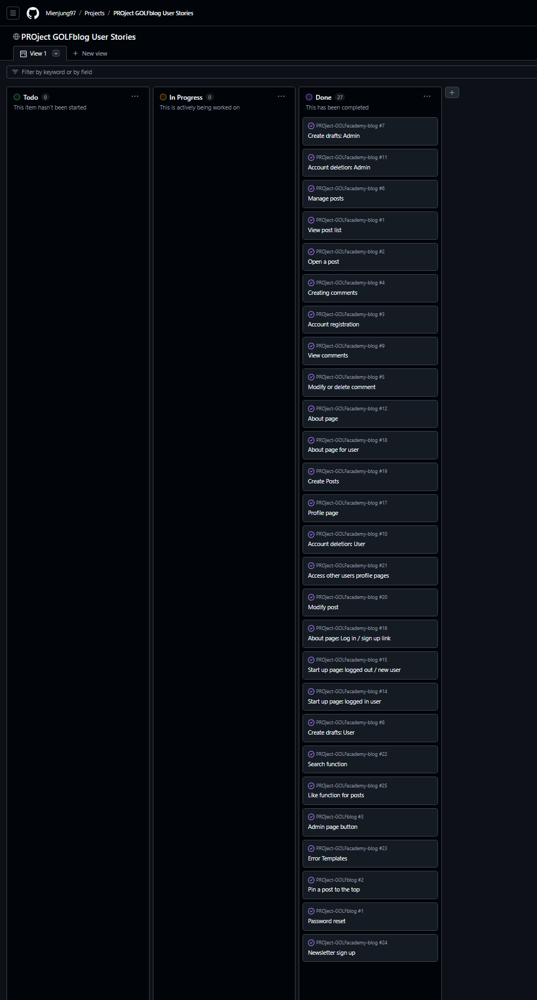

</details><br/>

### Repository Issues

Due to migration issues early in production, I had to restart the project in a new repository. The old repository is [PROject GOLDacademy blog](https://github.com/Mienjung97/PROject-GOLFacademy-blog) and the board has been moved to the new project. 

Since I had already created most user stories before, I assigned the user stories to the new project. The entire documentation can be traced in the individual user stories, including the labels that I added later. I started to use sprint labels, but have not followed through with them since this was my first django project, and I was unable to properly estimate the time needed for each user story. An example of the documentation can be seen here:

<details><summary><b>User Story documentation</b></summary>

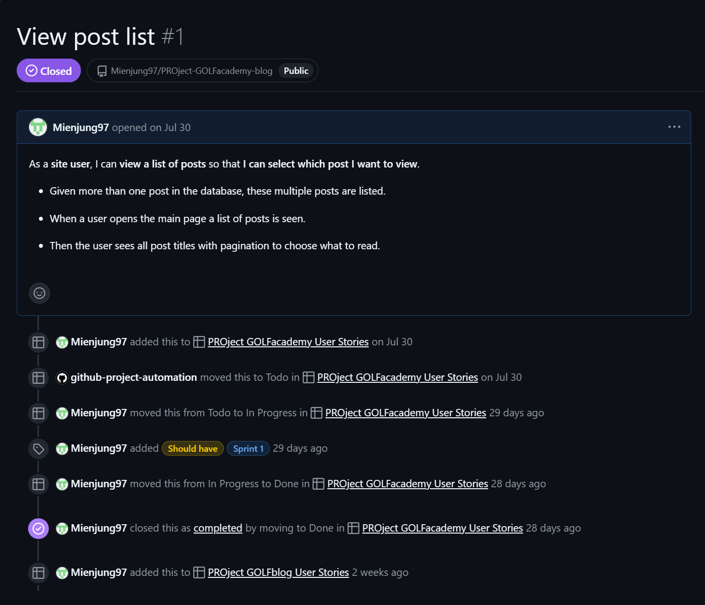

</details><br/>

[Back to top](<#table-of-content>)

### Database Schema

The database schema was created with [BugBytes](https://www.youtube.com/watch?v=qzrE7cfc_3Q&t=478s) YouTube video and the corresponding tool [dreampuf](https://dreampuf.github.io/GraphvizOnline/). Due to health issues I could not completely follow my time plan, therefore I was unable to create a database schema myself, which was planned to be done with [Lucid](https://lucid.app/documents#/home?folder_id=recent).

* **Post** - Handles all the posts
* **Comment** - Handles all the comments
* **Profile** - Handles the user profile information (first name, last name, bio and profile image for the specific user). There is a one-to-one relation to the user model to connect it to the standard user model.
* **About** - Handles the about information provided through the admin panel

<details><summary><b>Database Schema (Auto generated)</b></summary>

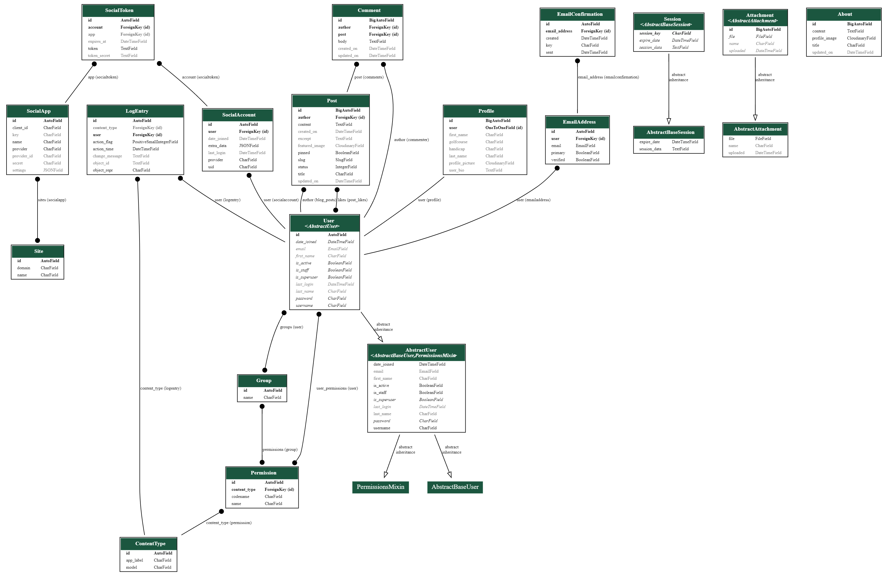
</details><br/>

# **User Experience (UX)**

## Wireframes
The wireframes for the site were created in the software [Balsamiq](https://balsamiq.com). The wireframes have been created for desktop, tablet and mobile devices. The text content wasn't finalized during the wireframe process.

<details><summary><b>Wireframes: Home</b></summary>

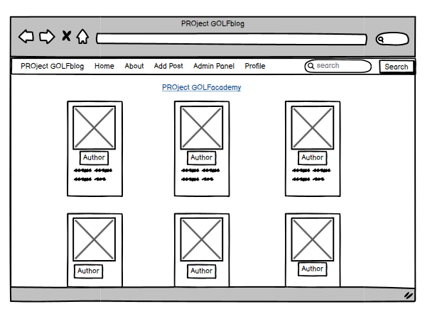
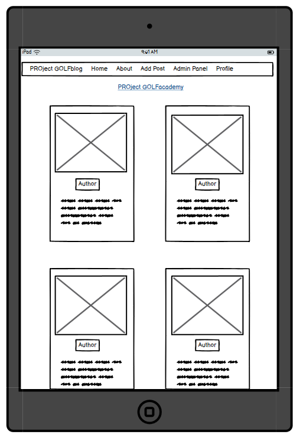
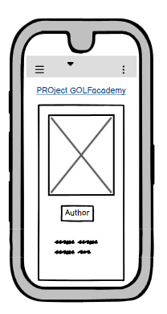
</details><br/>

<details><summary><b>Wireframes: About</b></summary>

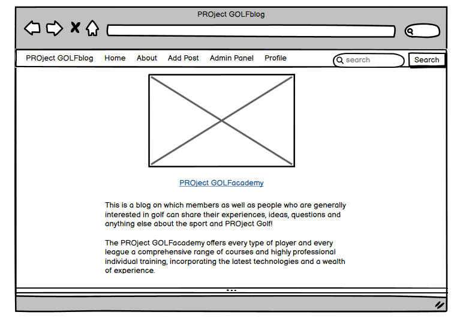
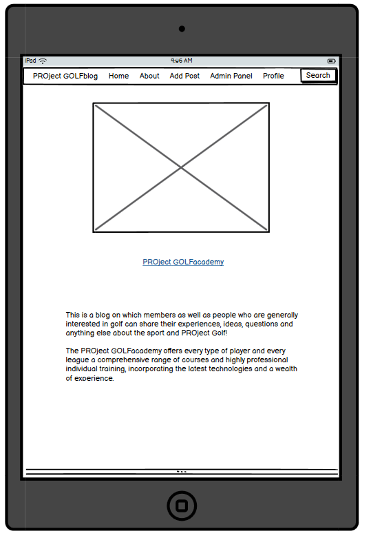
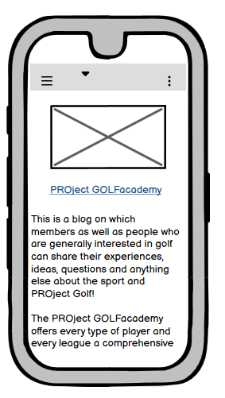
</details><br/>

<details><summary><b>Wireframes: Add Post</b></summary>

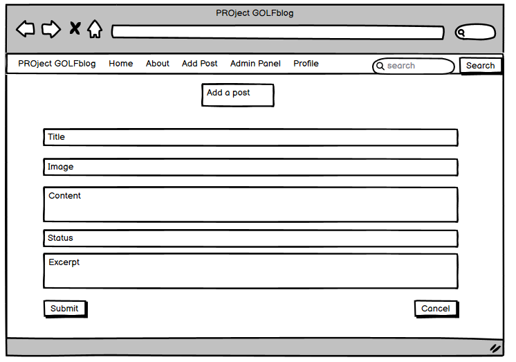
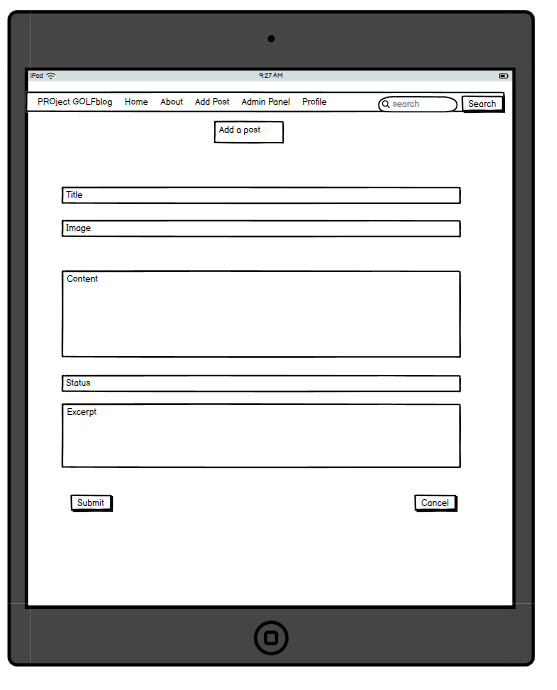
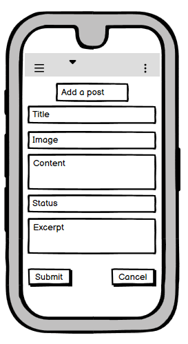
</details><br/>

<details><summary><b>Wireframes: Detail View</b></summary>


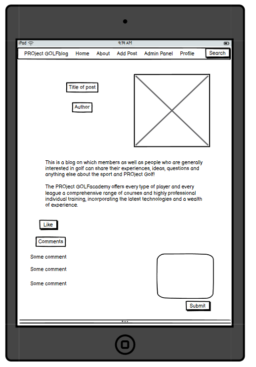
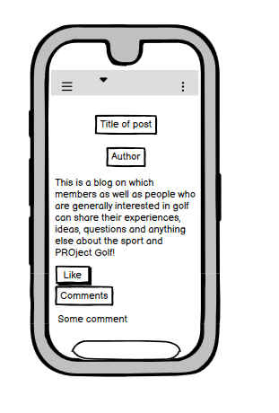
</details><br/>

<details><summary><b>Wireframes: Profile</b></summary>

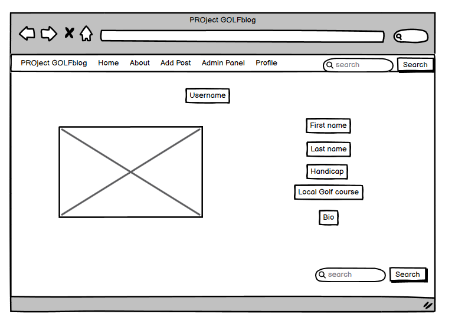
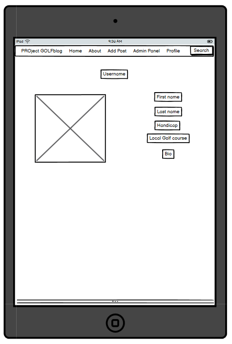
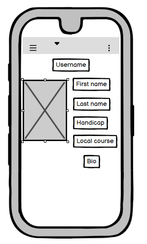
</details><br/>

## User Stories
Below the user stories for the project are listed to clarify why particular feature matters. These will then be tested and confirmed in the [Testing](<#testing>) section. In the Github board are two more user stories included, which are not part of the project yet and will be explained in the [Future Features](<#future-features>) section.

### Site User
|  | | |
|:-------:|:--------|:--------|
| As a Site User | I can view a list of posts so that I can select which post I want to view | &check; |
| As a Site User | I can click on a post so that I can view the whole post | &check; |
| As a Site User | I can register an account so that I can use all features on the webpage | &check; |
| As a Site User | I can create comments on posts so that I can express my opinion or share information related to a post | &check; |
| As a Site User | I can modify or delete my comments so that I can correct my comment or delete it, if it is not valid anymore. | &check; |
| As a Site User | I can create draft posts so that I can finish writing the content later | &check; |
| As a Site User | I can view comments on an individual post so that I can read the conversation | &check; |
| As a Site User | I can delete my account so that if I want to leave the website, I no longer have an active account | &check; |
| As a Site User | I will as a logged in user start the home page on the blog site so that I dont have to sign up or see the about page | &check; |
| As a Site User | While logged out or being a new user I will start on the about page so that I get information about what the website is about | &check; |
| As a Site User | As a logged out / new user I can press a button to sign in / sign up on the about page so that I don't have manually search for the link | &check; |
| As a Site User | I can access the about page so that they can get more information about the website | &check; |
| As a Site User | I can access my profile page so that I can modify and delete information about me | &check; |
| As a Site User | I can create posts so that I can share my thoughts on the blog | &check; |
| As a Site User | I can modify and delete my posts so that I can correct mistakes or delete irelevant posts | &check; |
| As a Site User | I can access the profile page of other users so that I can see who is posting/commenting | &check; |
| As a Site User | I can use the search function so that I can find posts, comments or users | &check; |
| As a Site User | I can access a page that results in an error so that I get a custom error html page | &check; |
| As a Site User | I can like posts so that other users see how well the post is perceived | &check; |

### Site Admin

|  | | |
|:-------:|:--------|:--------|
| As a Site Admin | I can create, read, update and delete posts so that manage my blog content | &check; |
| As a Site Admin | I can create draft posts so that I can finish writing the content later | &check; |
| As a Site Admin | I can delete accounts so that users who break the GTCs no longer have access to the blog | &check; |
| As a Site Admin | I can create an about page so that I can present information of the company | &check; |
| As a Site Admin | I can access the admin panel so that the url does not have to be typed manually | &check; |
| As a Site Admin | I can pin a post to the top so that other users can be informed about important infos | &check; |

[Back to top](<#table-of-content>)

## Site Structure

The PROject GOLFblog site is split up in two parts: **when the user is logged out** and **when the user is logged in**. Depending on login status, the user will either start on the **About** page with visible buttons for **log In** and **Register**, while a logged in user will start on the **Home** page.


When the user is logged out, the pages **About**, **Home**, as well as the **Search** bar are avaliable. A logged out user is able to access any post or comment to read - commenting, visiting profile pages, writing comments or posts and liking them is reserved for logged in users. Trying to access a profile page will redirect a user to the **Log In** page, in the comment section, the user is informed that a login is necessary to leave a **comment** or **like** a post.

If a user is logged in, they have the additional **Add Post** Nav-link which lets them create a new post and a **Profile** drop down menu, where they have access to their profile page (labled withe their **username**), the **Show Posts** section, in which they can see their published and drafted posts, as well as the **Logout** button. While visiting a posts site, they additionally have a **like** button and a field to leave a **comment**.

If a staff user is logged in, they have an additional **Amin Panel** button, which directs them to the django admin panel.

Read more about all functionalities in the [Features](<#features>) section.

[Back to top](<#table-of-content>)

## Design Choices

* ### Color Scheme
The color scheme was taken from the [PROject GOILFacademy](https://projectgolfacademy.com/) webpage, as well as the styling ideas.

[Coolors](https://coolors.co/) was used to create the color palette:

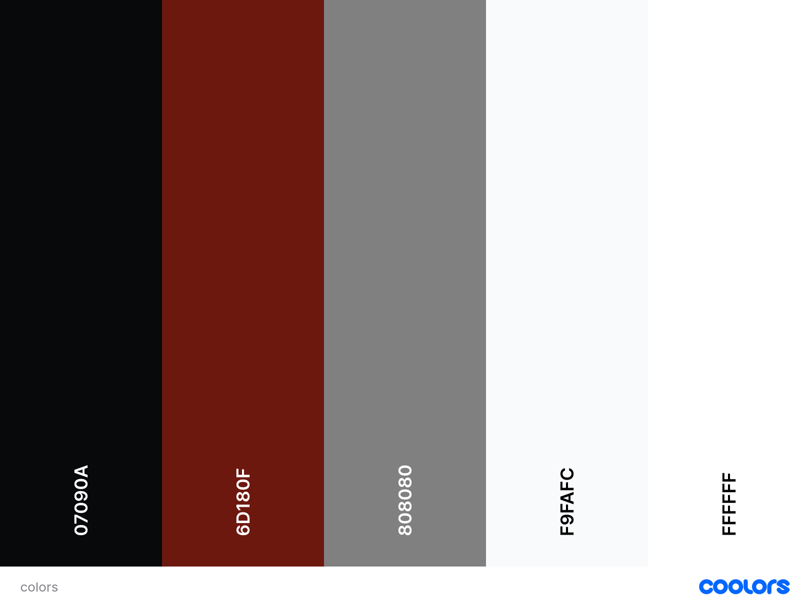

* ### Typography
The fonts used for the site are 'Poppins'. Fallback font is sans-serif.

* 'Poppins' is used on the whole webpage. Choosing this font family was purely because it is the same as the webpage from PROject GOLFacademy

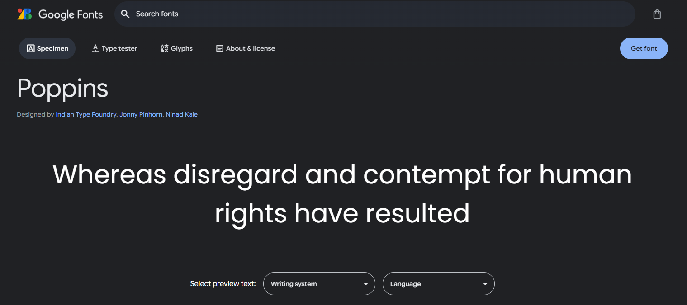

[Back to top](<#table-of-content>)

# **Features**
This section is devided in **Existing Features** and **Future Features** since there are more features needed for the production ready page.

## **Existing Features**

### **Navigation**
The styling of the navigation bar was heavily influenced by the [PROject GOLFacademy](https://projectgolfacademy.com/) website, while I tried to keep it as clean as possible. Depending if you are logged in or not, different menus are visible for the site user. **Log In** and **Register** will transform to the **Profile** dropdown, a staff member will get the extra menu item **Admin Panel**.


*Links that are visible to logged out users*

* About - Includes information about the PROject GOLFblog and the PROject GOLFacademy.
* Home - Lists all posts on the site.
* Search - a search bar that filters for profiles, posts and comments.
* Log In / Register - Gives the user the option to log in or register to the PROject GOLFblog.

<details><summary><b>Navigation Large - User Not Logged In</b></summary>

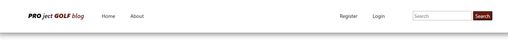
</details><br/>

<details><summary><b>Navigation Small - User Not Logged In</b></summary>

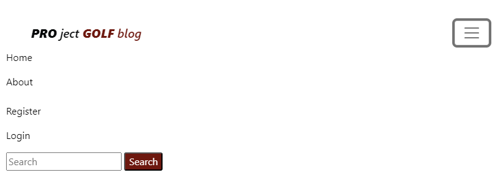
</details><br/>

*Links that are visible to logged in users*

All of the links that are visible to a not logged in user plus the ones below.

* Add Post - Lets the user create a new review.
* Profile - Acts as a drop down menu where the user can access the following:
- "Username" - Shows logged in users profile page.
- Show posts - Allows the user to access all their posts, including the ones they saved as a draft.
- Log Out - Logs out the user.

<details><summary><b>Navigation Large - User Logged In</b></summary>

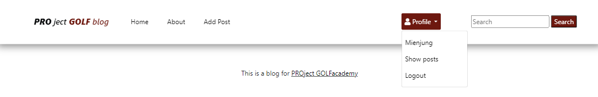
</details><br/>

<details><summary><b>Navigation Small - User Logged In</b></summary>

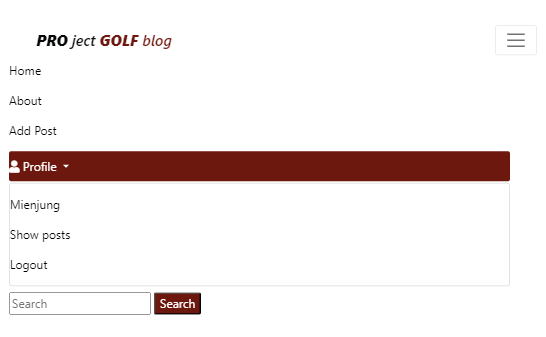
</details><br/>

*Link that is visible if user is staff*

All of the links above plus the one below
* Admin Panel - Directs the superuser to the django admin panel where they have full access to all users, posts, comments and more (see more in the features section)

<details><summary><b>Navigation Large - Admin Logged In</b></summary>

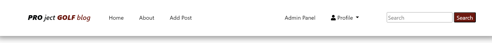
</details><br/>

<details><summary><b>Navigation Small - Admin Logged In</b></summary>

* For all logged in users (staff and non staff), the "Profile" button is a dropdown menu in both sizes of the navbar

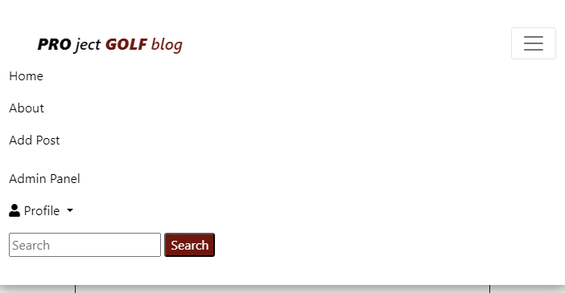
</details><br/>

<details><summary><b>Navigation - Search Function</b></summary>

* All users can use the search bar, which will return *Profiles*, (published) *Posts* and *Comments* related to the search

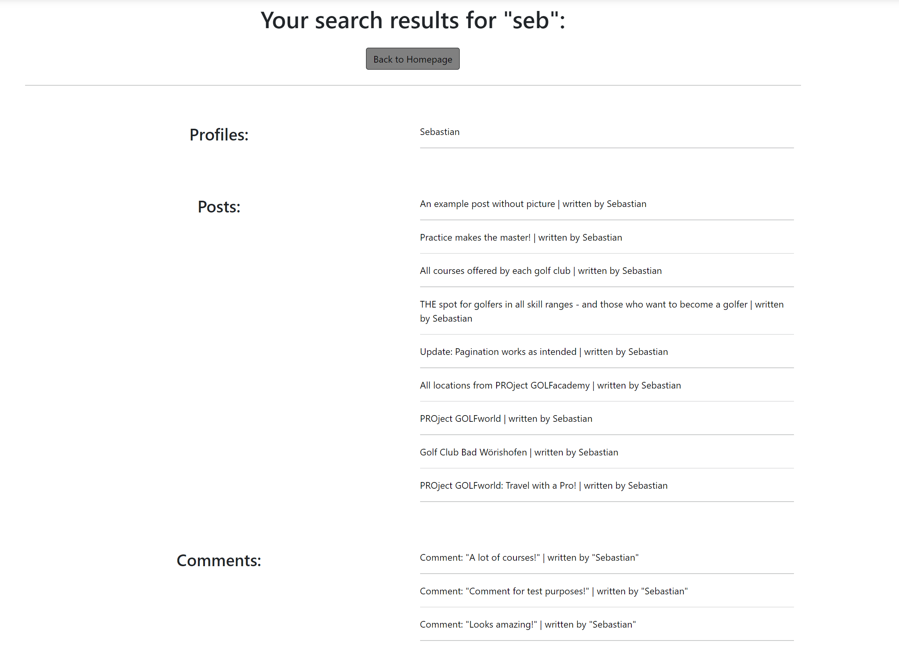
</details><br/>

<details><summary><b>Navigation Large - Page Indicator</b></summary>

* When hovering over any of the links in the Nav-bar, they will transform like in the screnshot below:


* This also applies for all grey buttons:

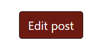
</details><br/>

<details><summary><b>Navigation Large - Pagination</b></summary>

* The buttons to navigate between the **Home** pages will only appear if there are enough posts. For 0 to 12 posts, there is no button. If there are more posts than that, the first page will only show the **NEXT** button, the last page only the **PREV** button and if there are more than 24 posts, any page inbetween will show both buttons. 
* The buttons are grey by default and turn red while hovering over them:

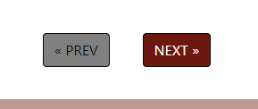
</details><br/>

### **About**
In the **About** section the user can read what the purpose of the PROject GOLFblog and GOLFacademy are.

<details><summary><b>About Section - User Not Logged In</b></summary>

* Buttons which redirect to **Log In** and **Register** will appear.

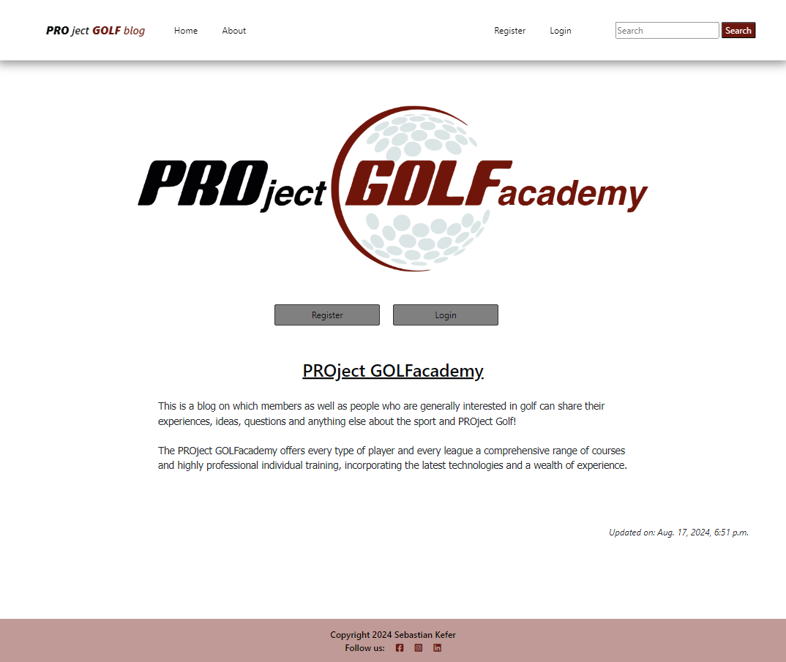
</details><br/>

<details><summary><b>About Section - User Logged In</b></summary>

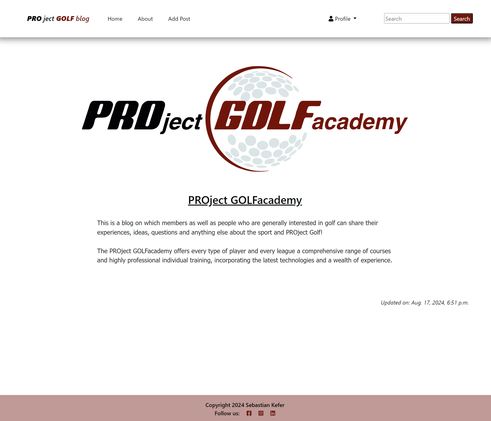
</details><br/>

### **Home**
The **Home** page lists all posts contained in the PROject GOLFblog, while being paginated by 12 posts per page and depending on the display size, will show between one and three posts next to each other. In the general overview, the posts picture, title, exerpt and like and comment count are visible. As a logged out user, this page is accessable, they can go through all pages and click on individual posts - visiting profile pages, liking and commenting is reserved for logged in users. More about these functionalities in in the [Post Detail View](<#post-detail-view>) section. Therefore besides the Nav-Bar, the page looks the same for any user. Any staff member has the ability to pin and unpin posts on the homepage, which leaves the sorting on the **Home** page as following: The first posts are the pinned posts (newest first), then the rest of the posts (newest first).

<details><summary><b>Home - All Posts</b></summary>

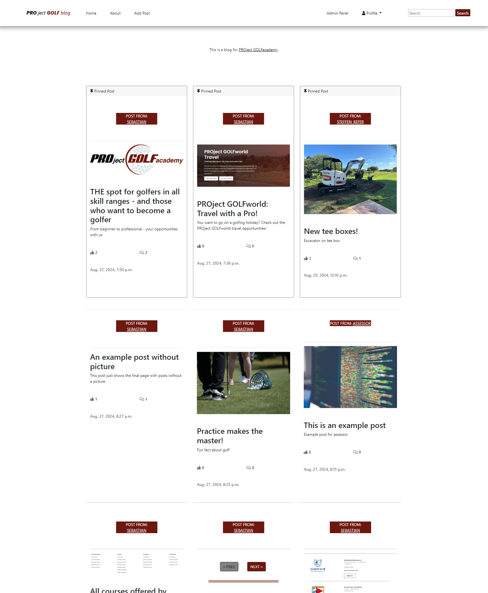
</details><br/>

<details><summary><b>Home - Select a post</b></summary>

* To select a post to get to the [Post Detail View](<#post-detail-view>), the whole area underneath the horizontal line is a clickable area.
* To select a [Profile Page](<#profile-page>), the user has to click the authors name.


</details><br/>

### **Post Detail View**
The **post detail** shows the whole post, which the user has chosen in the home view. Depending on if the user is logged out, in or is a staff member, the view has different options. If the user is logged in, they have the option to **like** the post and write a **comment** underneath, which they can **update** and **delete** afterwards. As a logged in staff member, they can also **pin** and **unpin** any post. If the post belongs to the logged in user, extra **CRUD elements** will be shown.

<details><summary><b>Post Detail View - User Logged Out</b></summary>

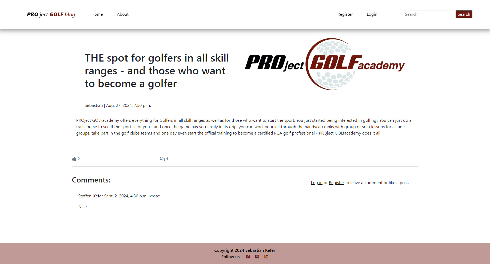
</details><br/>

<details><summary><b>Post Detail View - User Logged In</b></summary>

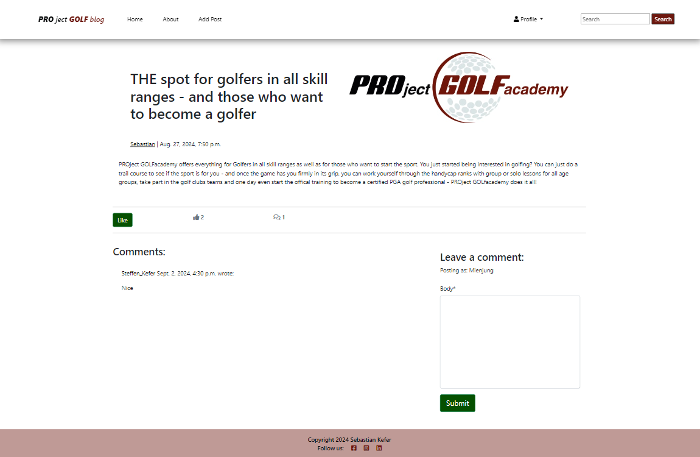
</details><br/>

<details><summary><b>Post Detail View - Staff member</b></summary>

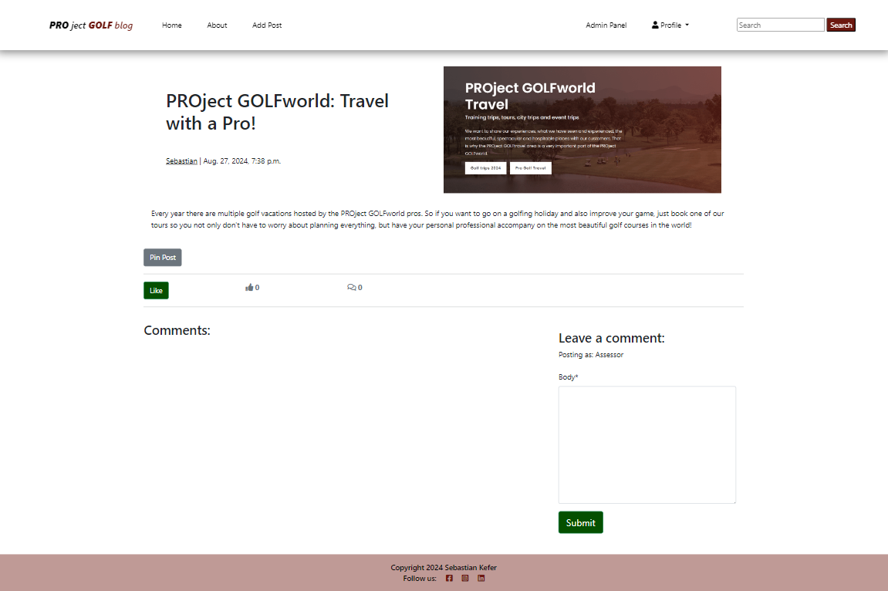
</details><br/>

<details><summary><b>CRUD functionalities</b></summary>

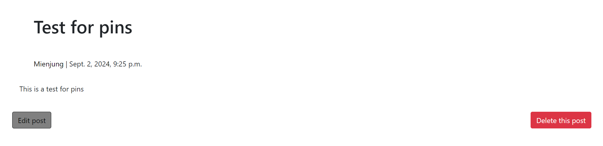
</details><br/>

<details><summary><b>Like and Unlike</b></summary>

Once a user has liked a post, the **Like** button will transform into the **Unlike** button and the like counter increases by one:

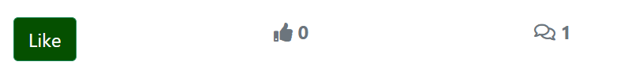
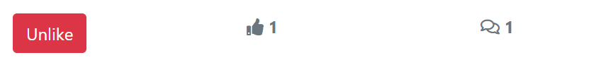
</details><br/>

### **Update And Delete Comment**
If the user is logged in and has written a comment, they can edit and delete the comment. If the user selects the **Edit** button, their written text will appear in the comment field, so it can be changed and the **Submit** button changes to **Update**. Clicking **Delete** will promt a modal asking if the user is sure to delete the comment.

<details><summary><b>Update Comment</b></summary>

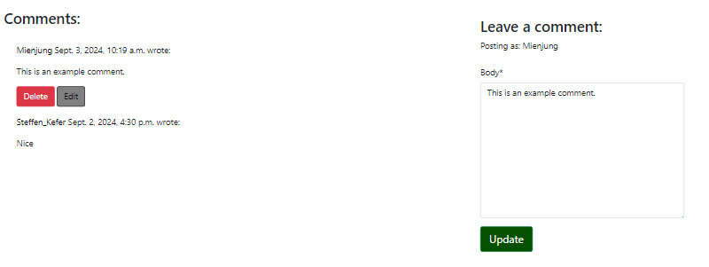
</details><br/>

<details><summary><b>Delete Comment Modal</b></summary>

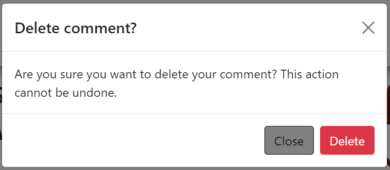
</details><br/>


### **Add Post**
On this page, a logged in user can create their own post which either can be published or saved as a draft for editing it at a later point. A post saved as a draft is only accessible by the author in their **Show Posts** section in the [Profile Page](<#profile-page>) dropdown or by any staff member in the [Admin Panel](<#admin-panel>). In this form, the user has to add a **Title**, the **Content** and set the **Status** to "draft" (default) or "published", while the **Featured Image** and the **Exerpt** are optional. Adding an **Exerpt** is recommended since this is the information which is displayed on the **Home** page. 

<details><summary><b>Add Post</b></summary>

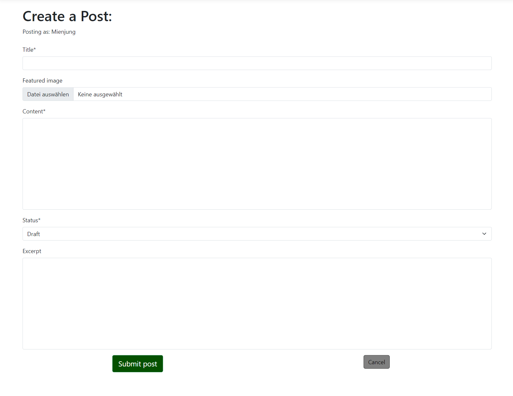
</details><br/>

### **Update Post**
While in the **post detail view** of a post belonging to the logged in user, they get extra CRUD functionalities with buttons to **Edit post** and **Delete this post**. **Edit post** will redirect the user to a form where they can edit every field in the post form while clicking **Delete this post** will promt a modal asking if the user is sure to delete the post.

<details><summary><b>Update Post</b></summary>

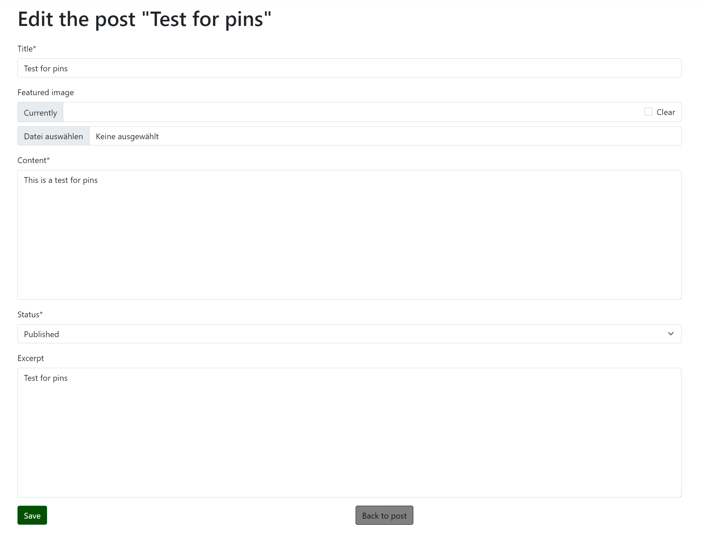
</details><br/>

<details><summary><b>Delete this post</b></summary>

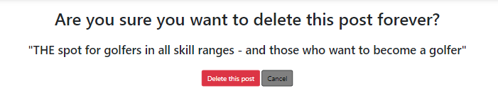
</details><br/>

### **Profile**
The **Profile** button in the nav-bar is a dropdown menu which contains the **Profile Page**, **Show Posts** and **Logout** links.

<details><summary><b>Profile Dropdown</b></summary>

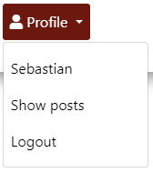
</details><br/>

### **Profile Page**
The profile page will appear in form of the **username**. It can be accessed by other logged in users via the **Home** or **Post detail** page as a "view only" version, while accessing your own profile page will give you full CRUD functionality.

<details><summary><b>Profile Page</b></summary>

* Page of other user
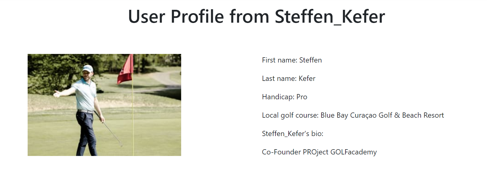
* Own profile page

</details><br/>

<details><summary><b>Profile Page Edit</b></summary>

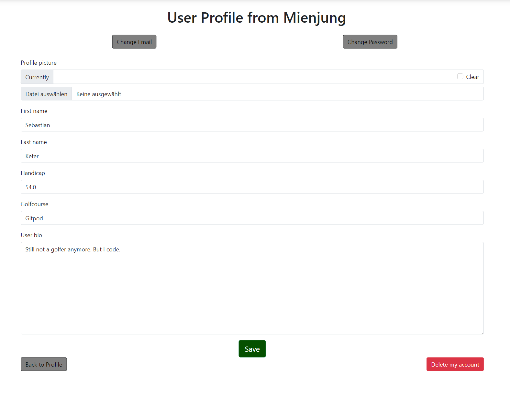
</details><br/>

<details><summary><b>Profile Page change email</b></summary>

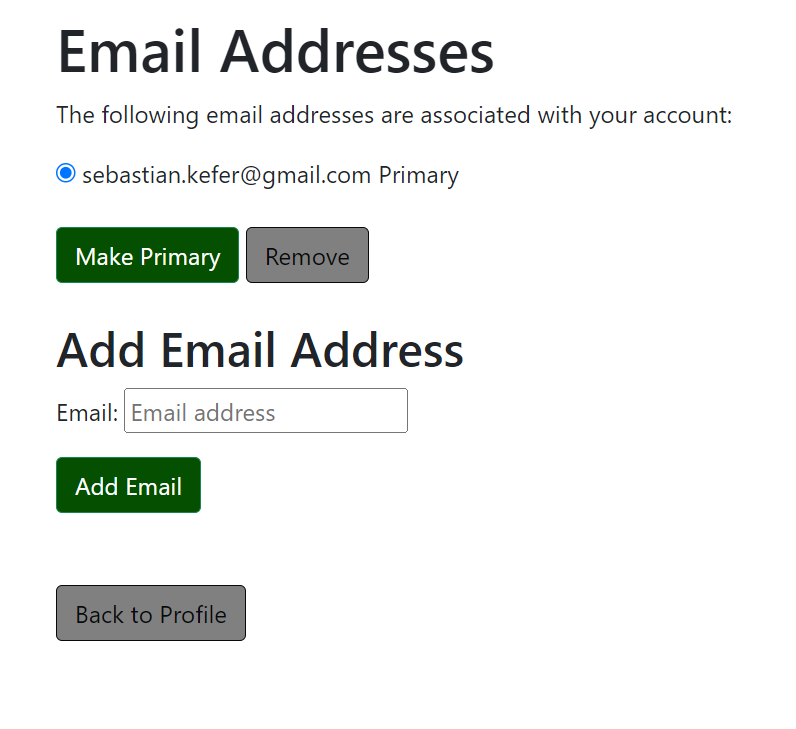
</details><br/>

<details><summary><b>Profile Page change password</b></summary>

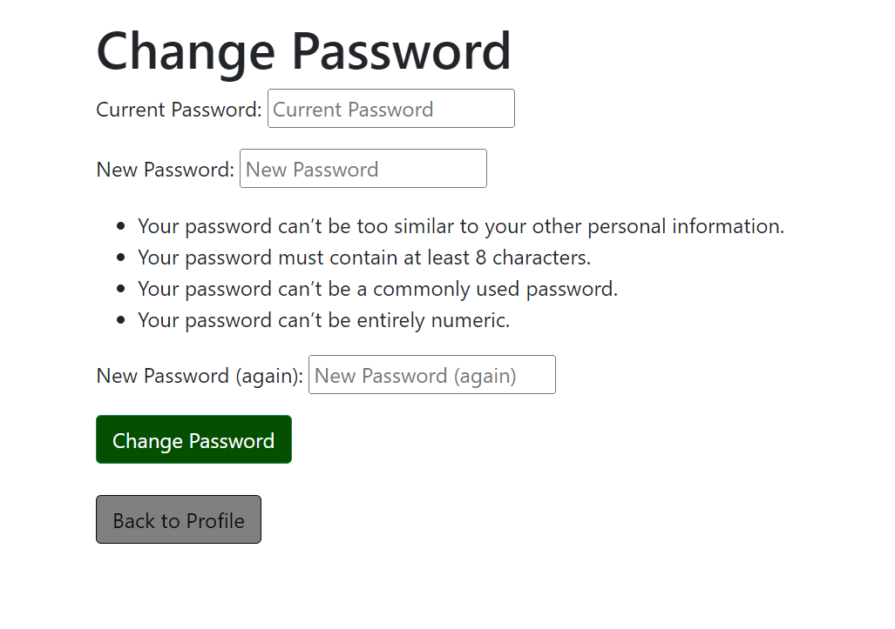
</details><br/>

<details><summary><b>Delete Profile Page Modal</b></summary>

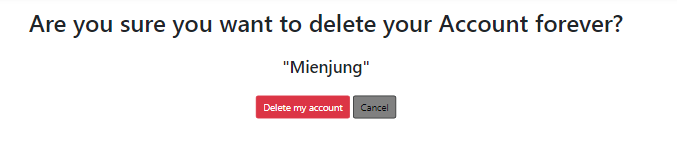
</details><br/>

### **Show Posts**
The **Show Posts** section is devided into the main page, on which published posts will appear and a page with all drafts, that can be accessed via the **View drafts** button. While clicking one of the published posts, it will redirect the user towads the **post detail view**, selecting a draft will open the **edit post** page.

<details><summary><b>Show posts</b></summary>

* View with published posts available

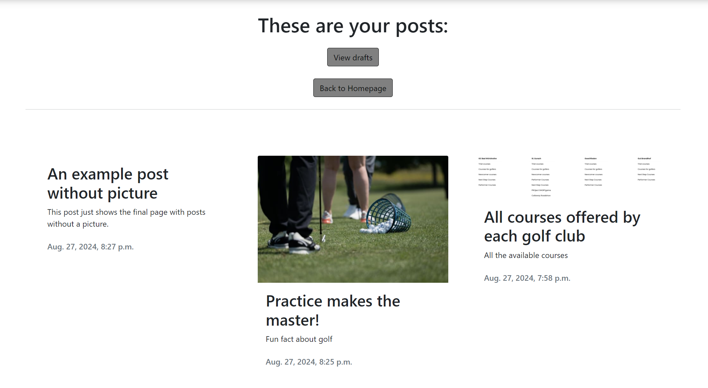

* View without posts available

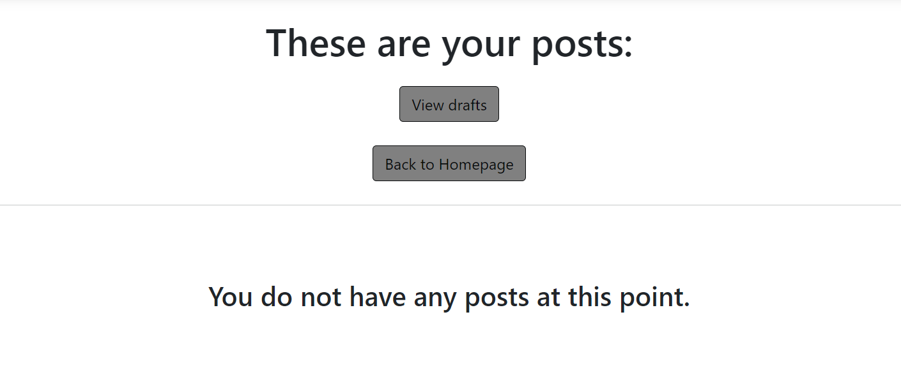
</details><br/>

<details><summary><b>View drafts</b></summary>

* View with drafts available (The posts in this picture have screenshots of exactly this topic as an image, there is no duplicate code)

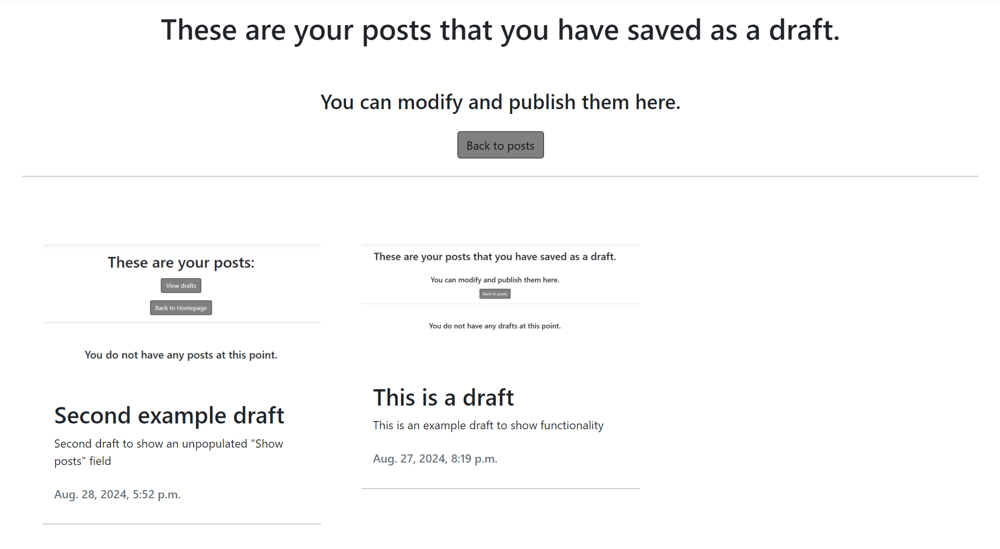

* View without drafts available

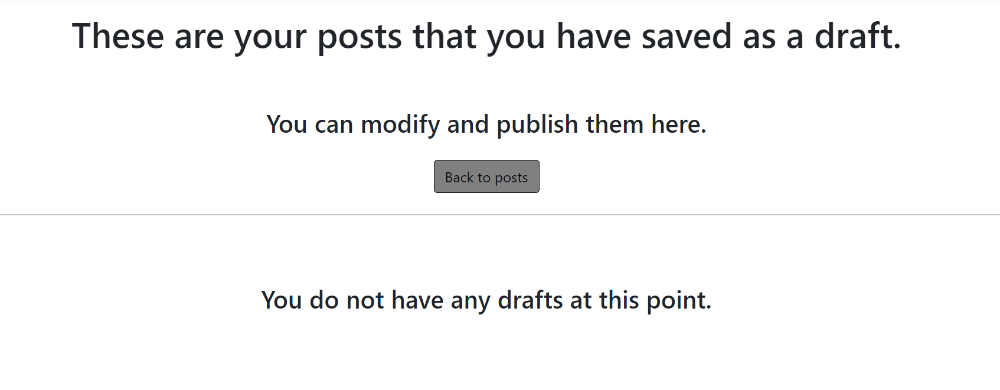

* Update Drafts

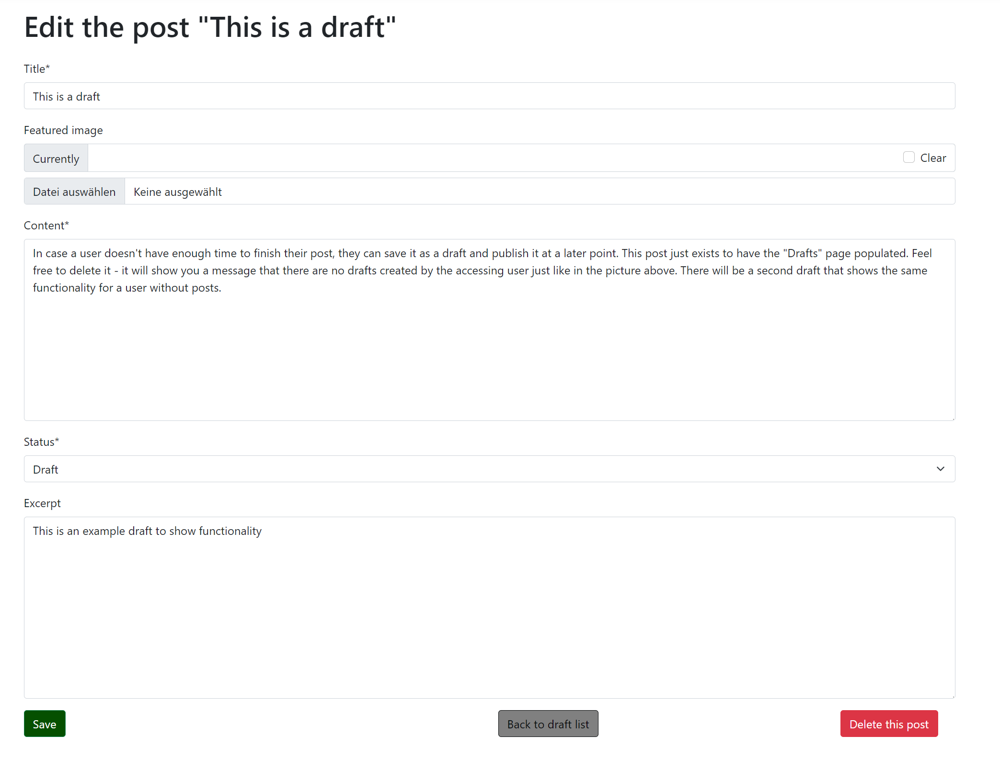
</details><br/>

### **Logout**
With this link, the user gets redirected to the **Logout** page which will ask the user if they really want to log out of the page.

<details><summary><b>Logout</b></summary>

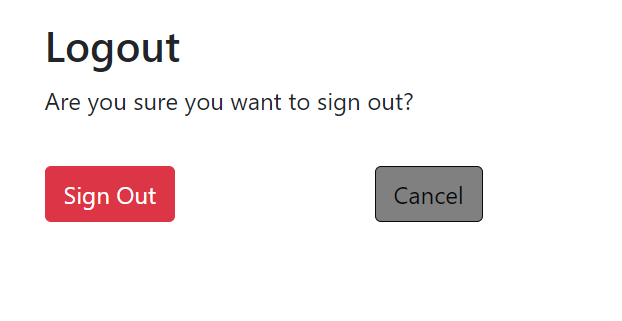
</details><br/>

### **Admin**
All staff members have the possibility to access the **Django admin panel**, as well as **Pin** and **Unpin** posts in the post detail view.

### **Admin Panel**
PROject GOLFblog makes use of the Django Admin Panel, including the Summernote libary. In the Admin Panel, any staff member has the full ability to **modify** and **delete** any post, comment, user or email, manage **pins**, collect information about **likes** on posts, as well as changing the about page.

<details><summary><b>Admin Panel</b></summary>

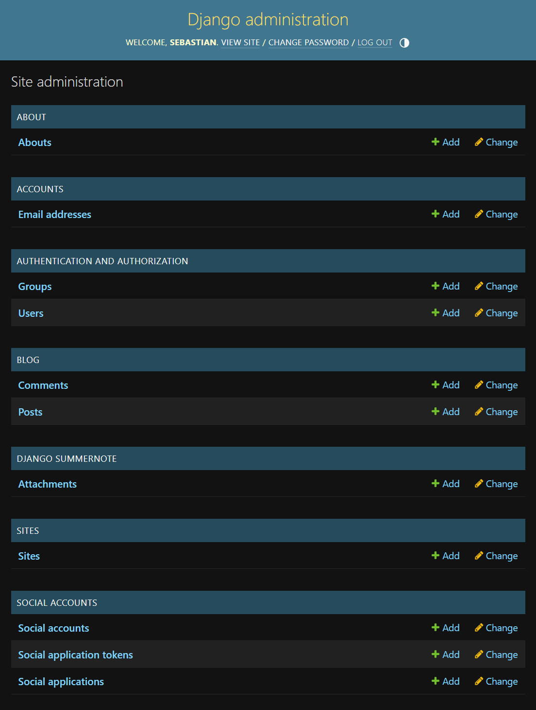
</details><br/>

### **Pin and Unpin Posts**
On the post detail view, a staff member can pin and unpin posts with the click of a button. This button will change from "Pin" to "Unpin" and vice versa after pressing it.

<details><summary><b>Pin and Unpin</b></summary>

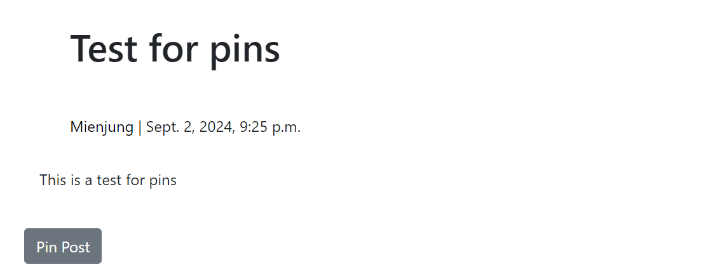
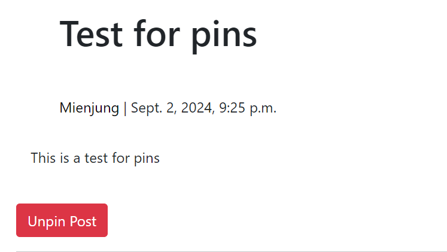
</details><br/>

<details><summary><b>Pinned Posts</b></summary>

An example view on how pinned posts look on the **home** page

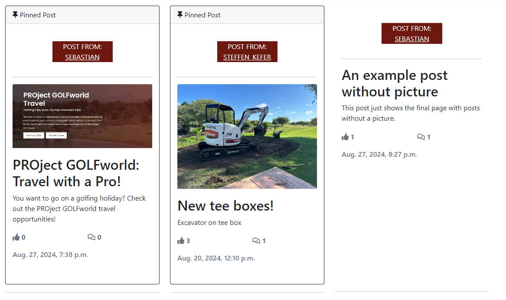
</details><br/>

### **Register**
When a logged out user enters the PROject GOLFblog, they will be redirected to the about page to gather information about the blog. If they decide to **register** or **log In**, they can either use the links in the nav-bar or the buttons in the middle of the About page. At the current stage, an email is necessary to register (Djangos "ACCOUNT_EMAIL_REQUIRED" is set to "True"), email varification is not yet implemented (more in the [Future Features](<#future-features>) section).

<details><summary><b>Register</b></summary>

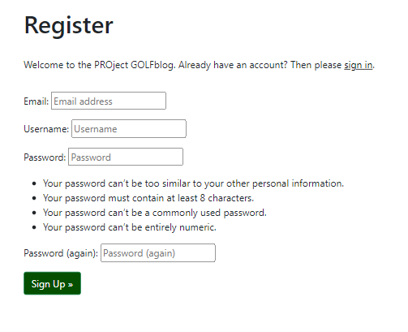
</details><br/>

### **Log In**
On this page the user can log into their profile from PROject GOLFblog.

<details><summary><b>Log In</b></summary>


</details><br/>

### **Footer**
The footer includes both my copyright, as well as functional the social media links (Facebook, Instagram and LinkedIn) from [PROject GOLFacademy](https://projectgolfacademy.com/).

<details><summary><b>Footer</b></summary>


</details><br/>

### **Confirmation Messages**
The sites utilizes confirmation messages which pop up for most actions that can be performed on the page. This applies to success and error messages, but the error messages are more rare.

This includes, but is not limted to
- Logging in and out
- Writing and updating a comment
- Writing and updating a post
- Register a new account
- Editing the profile page

Some examples are in the screenshots below:

<details><summary><b>Confirmation Messages</b></summary>

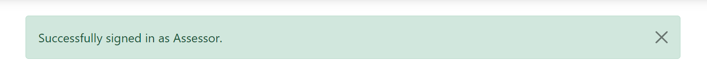
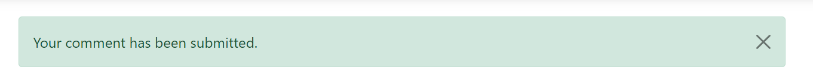
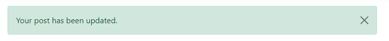
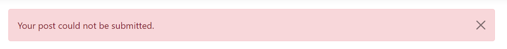
</details><br/>

### Future Features

* Custom user model for setting up propper email varification and password reset
* Add 'current page is active' in navbar
* Add categories for different topics (updates, free spaces in courses, requests for play partner, equipment discussions)
* Subscribing to the PROject GOLFacademy Newsletter
* Add / remove categorys in admin section
* View other peoples posts through their profile page
* Add possibility to add videos to posts
* Pin comments to the top of a comment section
* Implement the blog on the [PROject GOLFacademy](https://projectgolfacademy.com/) website

[Back to top](<#table-of-content>)

# Technologies Used

## Languages

* [Python](https://en.wikipedia.org/wiki/Python_(programming_language)) - Provides the functionality for the site.
* [HTML5](https://en.wikipedia.org/wiki/HTML) - Provides the content and structure for the website.
* [CSS3](https://en.wikipedia.org/wiki/CSS) - Provides the styling for the website.
* [JavaScript](https://en.wikipedia.org/wiki/JavaScript) - Provides interactive elements of the website

## Frameworks & Software
* [Bootstrap](https://getbootstrap.com/) - A CSS framework that helps building solid, responsive, mobile-first sites
* [Django](https://www.djangoproject.com/) - A model-view-template framework used to create the Review | Alliance site
* [Balsamiq](https://balsamiq.com/) - Used to create the wireframe.
* [Github](https://github.com/) - Used to host and edit the website.
* [GitBash](https://en.wikipedia.org/wiki/Bash_(Unix_shell)) - Terminal in [Gitpod](https://www.gitpod.io) used to push changes to the GitHub repository.
* [Heroku](https://en.wikipedia.org/wiki/Heroku) - A cloud platform that the application is deployed to.
* [Lighthouse](https://developer.chrome.com/docs/lighthouse/overview/) - Used to test performance of site.
* [Multi Mockup](https://techsini.com/multi-mockup/) - Used for responsiveness check.
* [Graph Models](https://django-extensions.readthedocs.io/en/latest/graph_models.html) - Used to create a *.dot file of all models in the project.
* [dreampuf](https://dreampuf.github.io/GraphvizOnline/) - Creates visually appealing database diagrams of *.dot files.
* [Google Chrome DevTools](https://developer.chrome.com/docs/devtools/) - Used to debug and test responsiveness.
* [Cloudinary](https://cloudinary.com/) - A service that hosts all static files in the project.
* [HTML Validation](https://validator.w3.org/) - Used to validate HTML code
* [CSS Validation](https://jigsaw.w3.org/css-validator/) - Used to validate CSS code
* [PEP8CI Validation](https://pep8ci.herokuapp.com/) - Used to validate the Python Code
* [JSHint Validation](https://jshint.com/) - Used to validate JavaScript code

## Libraries

[Back to top](<#table-of-content>)

The libraries used in this project are located in the requirements.txt file and have been documented below

* [asgiref](https://pypi.org/project/asgiref/) - ASGI is a standard for Python asynchronous web apps and servers to communicate with each other, and positioned as an asynchronous successor to WSGI
* [click](https://pypi.org/project/django-click/) - django-click is a library to easily write Django management commands using the click command line library
* [cloudinary](https://pypi.org/project/cloudinary/) - The Cloudinary Python SDK allows you to quickly and easily integrate your application with Cloudinary. Effortlessly optimize, transform, upload and manage your cloud's assets
* [Colorama](https://pypi.org/project/colorama/) - Makes ANSI escape character sequences (for producing colored terminal text and cursor positioning) work under MS Windows
* [crispy-bootstrap5](https://pypi.org/project/crispy-bootstrap5/) - Bootstrap5 template pack for django-crispy-forms
* [CSSbeautifier](https://pypi.org/project/cssbeautifier/) - Beautify, unpack or deobfuscate CSS
* [dj-database-url](https://pypi.org/project/dj-database-url/0.5.0/) - This simple Django utility allows you to utilize the 12factor inspired DATABASE_URL environment variable to configure your Django application
* [dj3-cloudinary-storage](https://pypi.org/project/dj3-cloudinary-storage/) - Django Cloudinary Storage is a Django package that facilitates integration with Cloudinary by implementing Django Storage API
* [Django](https://pypi.org/project/Django/) - Django is a high-level Python web framework that encourages rapid development and clean, pragmatic design.
* [django-allauth](https://pypi.org/project/django-allauth/) - Integrated set of Django applications addressing authentication, registration, account management as well as 3rd party (social) account authentication.
* [django-crispy-forms](https://pypi.org/project/django-crispy-forms/) - Used to integrate Django DRY forms in the project
* [django-extensions](https://pypi.org/project/django-extensions/) - Django Extensions is a collection of custom extensions for the Django Framework
* [django-summernote](https://pypi.org/project/django-summernote/) - Summernote is a simple WYSIWYG editor which allows you to embed Summernote into Django very handy. Support admin mixins and widgets.
* [djLint](https://pypi.org/project/djlint/) - djLint is a community build project to and add consistency to html templates
* [EditorConfig](https://pypi.org/project/EditorConfig/) - EditorConfig makes it easy to maintain the correct coding style when switching between different text editors and between different projects. The EditorConfig project maintains a file format and plugins for various text editors which allow this file format to be read and used by those editors
* [gunicorn](https://pypi.org/project/gunicorn/) - Gunicorn ‘Green Unicorn’ is a Python WSGI HTTP Server for UNIX. It’s a pre-fork worker model ported from Ruby’s Unicorn project. The Gunicorn server is broadly compatible with various web frameworks, simply implemented, light on server resource usage, and fairly speedy
* [html-tag-names](https://pypi.org/project/html-tag-names/) - This is a list of HTML tag names. It includes ancient (for example, nextid and basefont) and modern (for example, shadow and template) names from the HTML living standard. The repo includes scripts to regenerate the data from the specs
* [html-void-elements](https://pypi.org/project/html-void-elements/) - Similar to "html-tag-names"
* [jsbeautifier](https://pypi.org/project/jsbeautifier/) - Beautify, unpack or deobfuscate JavaScript. Handles popular online obfuscators.
* [oauthlib](https://pypi.org/project/oauthlib/) - OAuthLib is a framework which implements the logic of OAuth1 or OAuth2 without assuming a specific HTTP request object or web framework
* [pathspec](https://pypi.org/project/pathspec/) - pathspec is a utility library for pattern matching of file paths. So far this only includes Git’s wildmatch pattern matching which itself is derived from Rsync’s wildmatch. Git uses wildmatch for its gitignore files
* [psycopg2](https://pypi.org/project/psycopg2/) - Psycopg is the most popular PostgreSQL database adapter for the Python programming language.
* [PyJWT](https://pypi.org/project/PyJWT/) - A Python implementation of RFC 7519.
* [python3-openid](https://pypi.org/project/python3-openid/) - OpenID support for modern servers and consumers
* [regex](https://pypi.org/project/regex/) - This regex implementation is backwards-compatible with the standard ‘re’ module, but offers additional functionality like enabling other Python threads to run concurrently
* [requests-oauhlib](https://pypi.org/project/requests-oauthlib/) - Provides first-class OAuth library support for Requests.
* [sqlparse](https://pypi.org/project/sqlparse/) - sqlparse is a non-validating SQL parser for Python. It provides support for parsing, splitting and formatting SQL statements.
* [tqdm](https://pypi.org/project/tqdm/) - Instantly make your loops show a smart progress meter when coding in the console
* [urllib3](https://pypi.org/project/urllib3/1.26.19/) - urllib3 is a powerful, user-friendly HTTP client for Python
* [whitenoise](https://pypi.org/project/whitenoise/) - Radically simplified static file serving for Python web apps. WhiteNoise allows your web app to serve its own static files, making it a self-contained unit that can be deployed anywhere without relying on nginx, Amazon S3 or any other external service

# Testing

## Testing User Stories

* As a Site User | I can view a list of posts so that I can select which post I want to view
    * On the **Home** page, any user will see all the posts

* As a Site User | I can click on a post so that I can view the whole post
   * A user can click underneath the "Author" section of any post on the **Home** page to see the whole post detail view

* As a Site User | I can register an account so that I can use all features on the webpage
   * When clicking the **Register** link in the nav-bar or on the about page, a profile can be created (Username, email and password are necessary)

* As a Site User | I can create comments on posts so that I can express my opinion or share information related to a post
    * When a user is logged in, they can comment on any post in the comment section

* As a Site User | I can modify or delete my comments so that I can correct my comment or delete it, if it is not valid anymore
    * After writing a comment, a user can modify them by clicking "Edit" or delete the comment with the "Delete" button

* As a Site User | I can create draft posts so that I can finish writing the content later
    * When creating a post, the default status is "Draft". Unless the user changes the status to "Published", the post will be saved as a draft and can be accessed in the "Show Posts" -> "View Drafts" section to be modified, published or deleted

* As a Site User | I can view comments on an individual post so that I can read the conversation
    * When going to a posts detail view, any user can see all the comments

* As a Site User | I can delete my account so that if I want to leave the website, I no longer have an active account
    * In the "Edit Profile" section on the profile page is a "Delete my account" button that deletes the profile after confirming the choice

* As a Site User | I will as a logged in user start the home page on the blog site so that I dont have to sign up or see the about page
    * When still logged in, entering the "base" url will redirect the user to the **Home** page

* As a Site User | While logged out or being a new user I will start on the about page so that I get information about what the website is about
    * When not logged in, entering the "base" url will redirect the user to the **About** page

* As a Site User | As a logged out / new user I can press a button to sign in / sign up on the about page so that I don't have manually search for the link
    * When not logged in, the **About** page will show buttons labled "Register" and "Log In" which redirects the user to the corresponding link

* As a Site User | I can access the about page so that they can get more information about the website
    * When a user is logged in, they can still visit the **About** page

* As a Site User | I can access my profile page so that I can modify and delete information about me
    * When a user is logged in, they have a dropdown menu called "Profile" through which they can navigate towards their profile page. On the bottom of this page is a "Edit Profile" button, where they can change or delete their profile information

* As a Site User | I can create posts so that I can share my thoughts on the blog
    * In the Nav-bar is a link "Add Post" that lets a logged in user create a post

* As a Site User | I can modify and delete my posts so that I can correct mistakes or delete irelevant posts
    * When a user is logged in, they have a dropdown menu called "Profile" through which they can navigate towards the "Show Posts" section. In this section, all of the users posts will be displayed and by clicking on the post, they will be redirected to the posts detail view. There the "Edit Post" and "Delete Post" buttons are available for the posts author

* As a Site User | I can access the profile page of other users so that I can see who is posting/commenting
    * On the **Home** page and in a posts detail view, a logged in user can click on the authors username, as well as on the author of a comment to get to their profile page

* As a Site User | I can use the search function so that I can find posts, comments or users
    * When entering any type of string into the search function, the user gets all profiles, posts and comments presented, in which the searched for string is found. The user will also get a notification, if any of the categories do not have a match or if the user did not search for anything at all
    * **New bug**: Posts will still be displayed, but without their title

* As a Site User | I can access a page that results in an error so that I get a custom error html page
    * If a user tries to enter a wrong url, a custom "Error 404" page will load
    * An "Error 500" page has been implemented and worked last time I encountered it. I do not know how to reproduce this error for additional testing

* As a Site User | I can like posts so that other users see how well the post is perceived
   * When a user is logged in, they can like and unlinke any post. The amount of likes can be seen by any user both on the home page as on the posts detail view page

* As a Site Admin | I can create, read, update and delete posts so that manage my blog content
    * Both on the frontend as well as in the admin panel, an admin can create, read, update and delete any post

* As a Site Admin | I can create draft posts so that I can finish writing the content later
    * Both on the frontend as well as in the admin panel, an admin can create a draft post

* As a Site Admin | I can delete accounts so that users who break the GTCs no longer have access to the blog
    * In the Django Admin panel, an Admin can delete any user

* As a Site Admin | I can create an about page so that I can present information of the company
    * In the Django Admin panel, an Admin can modify or create a new **About** page with Picture, Title and Content

* As a Site Admin | I can access the admin panel so that the url does not have to be typed manually
    * If a staff member is logged in, they have an additional Nav-bar link that redirects them to the admin panel

* As a Site Admin | I can pin a post to the top so that other users can be informed about important infos
    * Both on the frontend as well as in the admin panel, an admin can select a post and pin and unpin it from the top of the homepage

## Code Validation
The code on the 'PROject GOLFblog' site has been tested through W3C Markup Validation Service, W3C CSS Validation Service, JSHint and the CodeInstutute pep8 validator. Errors were at first found on the site in the W3C Markup Validation Service but could quite easily be fixed (see bugs section). 

### Markup Validation
While validating the HTML code, I encountered a few errors. The **About** page displays 2 errors concerning the "font element" - this is produced through the Summernote extension. Since the Markup validator is not an authenticated user, I could only validate the **Home** and **About** page via url input - so with use of the chrome developer tools I validated every page via direct input. No errors came up, proof for all validations are in the folder with path "readme/assets/images/validation/html"

<details><summary><b>HTML Validation Result</b></summary>

* Home page:

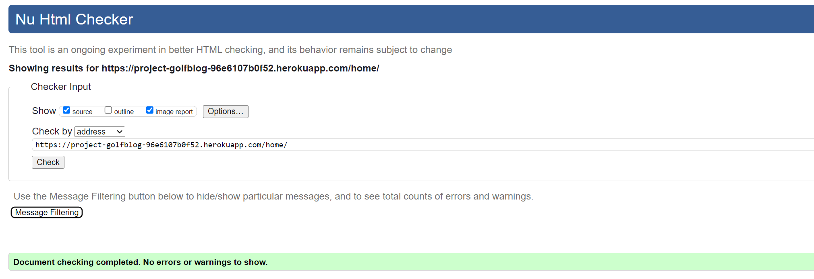

* About page:

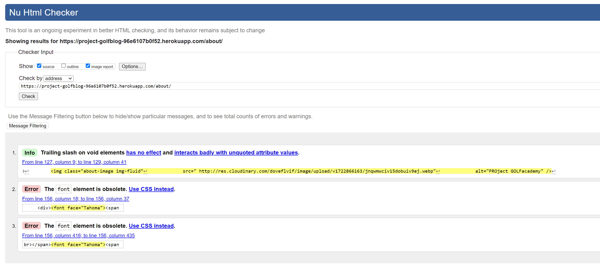
</details><br/>

[Back to top](<#table-of-content>)

### CSS Validaton
When validating my own code the W3C CSS Validator reports no errors.

<details><summary><b>CSS Validation Result</b></summary>

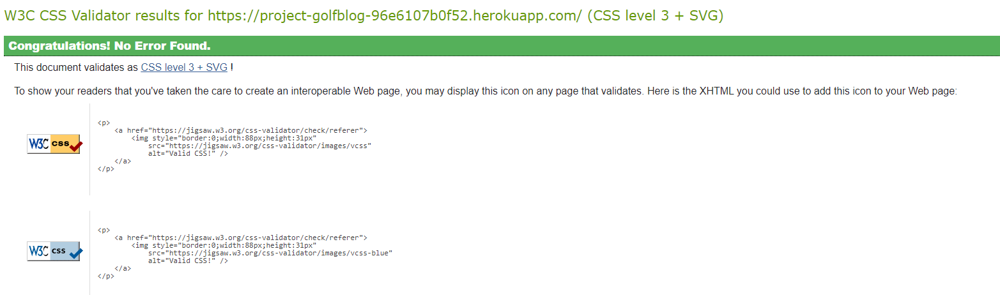
</details><br/>

[Back to top](<#table-of-content>)

### PEP Validation
To validate the python files, I have used the [pep8 CodeInstitute linter](https://pep8ci.herokuapp.com/) I have tested all python files in my project without getting any errors. The documentation can be found in the path "readme/assets/images/validation/python". Every picture is labled with the first letter as the corresponding app (a=about, b=blog, u=userprofile and p=project_golfblog) and the name of the python file. None of the 25 files reported an error.

[Back to top](<#table-of-content>)

### JavaScript Validation
The JSHint validator results can be seen below:

No errors were returned when passing through JSHint (comments.js), the test reported one undefined variable connected to Bootstrap and gave out 19 warnings. None of these are problematic.

<details><summary><b>JSHint Validation Result</b></summary>

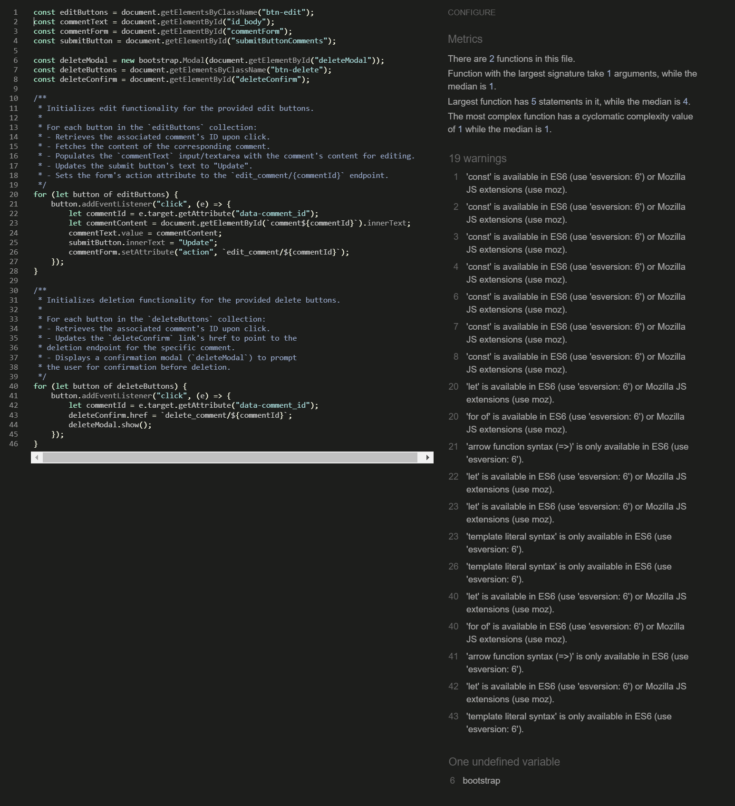
</details><br/>

[Back to top](<#table-of-content>)

## Additional Testing

### Manual Testing

In addition to tests stated above I have performed a series of manual tests. Below the list of tests that has been conducted can be found.

| Status | **Main Website - User Logged Out**
|:-------:|:--------|
| &check; | Typing in a incorrect URL on the page loads the 404 error page
| &check; | Pasting page that needs authentication loads the log in page
| &check; | Clicking the nav logo loads the home page
| &check; | Clicking the Home button on the nav bar loads the home page and lists all posts
| &check; | Clicking the Register link loads the Register page
| &check; | Clicking the Log In link loads the Log In page 
| &check; | 12 posts are rendered for the user on home page before pagination kicks in 
| &check; | Clicking the area underneath the author on the a post card loads the review detail page
| &check; | In the details view or the home page, clicking any username will redirect to the Log In page
| &check; | In the details view the user cannot create a comment
| &check; | Clicking the Facebook link in the footer area opens Facebook in a new window 
| &check; | Clicking the Instagram link in the footer area opens Instagram in a new window 
| &check; | Clicking the LinkedInlink in the footer area opens LinkedIN in a new window 

| Status | **Main Website - User Logged In**
|:-------:|:--------|
| &check; | Typing in a incorrect URL on the page loads the 404 error page
| &check; | User cannot access Admin Panel without being staff member
| &check; | Clicking the nav logo loads the home page
| &check; | Clicking the Home button on the nav bar loads the home page and lists all posts
| &check; | 12 posts are rendered for the user on home page before pagination kicks in 
| &check; | Clicking the area underneath the author on the a post card loads the review detail page
| &check; | In the details view or the home page, clicking any username will redirect to their page
| &check; | In the detail view the logged in user can comment underneath a post
| &check; | When user submits a comment a confirmation message is being shown on the page
| &check; | In the detail view the logged in user can update/delete the comments written by themselves
| &check; | Clicking the update button the comment text will show in the comment box
| &check; | Clicking the delete button loads the delete comment page
| &check; | In the detail view the logged in user can like/unlike posts
| &check; | In the detail view the logged in user can update/delete the post written by themselves
| &check; | Clicking the edit button in the detail view loads the edit post page
| &check; | Clicking the like button will like the post and the button will change to unlike
| &check; | Clicking the delete button in the detail view loads the delete post page
| &check; | Clicking the Show Posts button in the logged in user menu lists the logged in users posts
| &check; | Clicking the Show Drafts button in Show posts lists the logged in users drafts
| &check; | In the logged in user menu the Admin Area is not visible
| &check; | Clicking the Profile Page button in the logged in user menu loads the Profile page
| &check; | Clicking the PROject GOLFacademy link anywhere opens the page in a new window 
| &check; | Clicking the Instagram link in the footer area opens Instagram in a new window
| &check; | Clicking the Facebook link in the footer area opens Facebook in a new window 
| &check; | Clicking the LinkedInlink in the footer area opens LinkedIN in a new window 

| Status | **Main Website - Admin Logged In**
|:-------:|:--------|
| &check; | Clicking the Admin Panel button in the Nav-bar loads the Admin Panel Page
| &check; | Pinning a post works on frontend
| &check; | Deleting a Profile works on the Admin Panel
| &check; | Deleting a Post works on the Admin Panel
| &check; | Deleting a Comment works on the Admin Panel
| &check; | Changing an email of any user works in the admin bar
| &check; | Changing a password of any user works in the admin bar
| &check; | Deleting a Profile will delete their posts, comments and email

 Status | **Create A Post - User Logged In**
|:-------:|:--------|
| &check; | Title field is required
| &check; | Title field does not accept empty field
| &check; | Title field does not accept just spaces
| &check; | Featured Image is not required
| &check; | Content field is required
| &check; | Content field does not accept empty field
| &check; | Excerpt is not required
| &check; | Status field defaults to Draft
| &check; | Posting as shows name of author
| &check; | **Home** page with a success message is displayed when the user submits the post

Status | **Create A New User - User Logged Out**
|:-------:|:--------|
| &check; | Username field is required
| &check; | Username field does not accept empty field
| &check; | Email field does not accept just spaces
| &check; | Email field is required
| &check; | Password field does not accept empty field
| &check; | Success message is displayed when the user creates a new user
| &check; | Error message with corresponding info when wrong input is submitted
| &check; | Default biography is visible in about page

Status | **Create A Profile Page - User Logged In**
|:-------:|:--------|
| &check; | The default profile info is seen on the profile page (Field not provided)
| &check; | The profile success message is displayed when the user submits the profile form
| &check; | A new user has all rights and can post, like and comment after registering
| &check; | Accessing the Show Posts and Schow drafts section works

### Automated Testing
Besides the "test_forms.py" file from the walkthough project, there has been no automated testing included in this project.

### Responsiveness Test
The responsive design tests were carried out manually with [Google Chrome DevTools](https://developer.chrome.com/docs/devtools/) and [Multi Device Mockup Generator](https://techsini.com/multi-mockup/).

| Desktop    | Display <1200px       | Display >1200px    |
|------------|-----------------------|--------------------|
| Render     | pass                  | pass               |
| Images     | pass                  | pass               |
| Links      | pass                  | pass               |

| Tablet     | iPad Air              | Asus Zenbook Fold  | iPad Mini | iPad Pro |
|------------|-----------------------|--------------------|-----------|----------|
| Render     | pass                  | pass               | pass      | pass     |
| Images     | pass                  | pass               | pass      | pass     |
| Links      | pass                  | pass               | pass      | pass     |

| Phone      | Galaxy S8+/S20 Ultra  | iPhone XR/12Pro/14 Pro Max | Pixel 7 / 7 Pro      |
|------------|-----------------------|----------------------------|----------------------|
| Render     | pass                  | pass                       | pass      | pass     |
| Images     | pass                  | pass                       | pass      | pass     |
| Links      | pass                  | pass                       | pass      | pass     |

[Back to top](<#table-of-content>)

### Browser Compatibility
* Google Chrome Version (version 128.0.6613.119)
* Mozilla Firefox (version 127.0 )
* Microsoft Edge (version 128.0.2739.54)

[Back to top](<#table-of-content>)

### Lighthouse
Google Lighthouse in Chrome Developer Tools was used to test the application within the areas of *Performance*, *Accessibility*, *Best Practices* and *SEO*. I tested the *Home page*, *post details page*, *Add Post* and *the about page* both on Destop and mobile view as well as logged in and logged (if possible). The testing showed the following:

<details><summary><b>Lighthouse Home Result</b></summary>

* Desktop view: Logged in
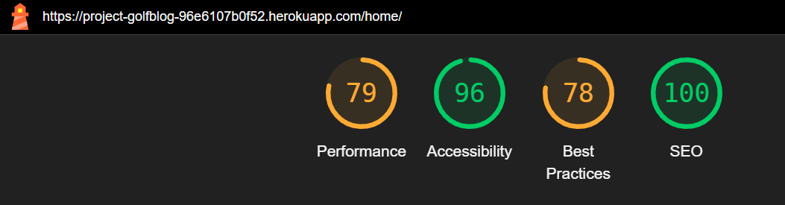

* Desktop view: Logged out
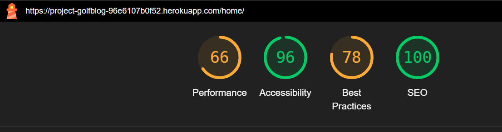

* Mobile view: Logged in
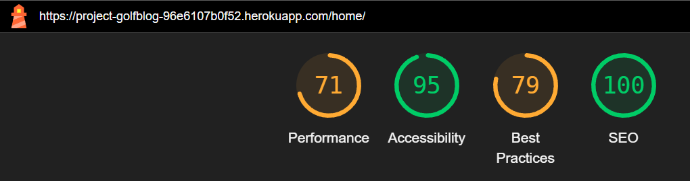

* Mobile view: Logged out
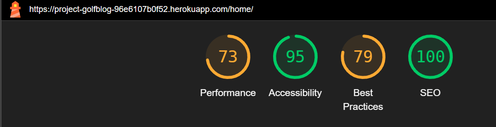
</details><br/>

<details><summary><b>Lighthouse Profile Result</b></summary>

* Desktop view
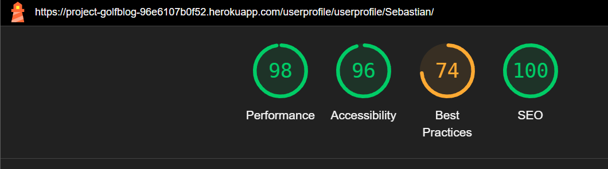

* Mobile view
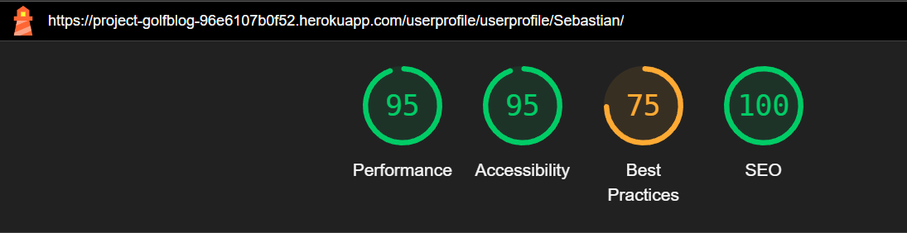
</details><br/>

<details><summary><b>Lighthouse Edit Profile Result</b></summary>

* Desktop view
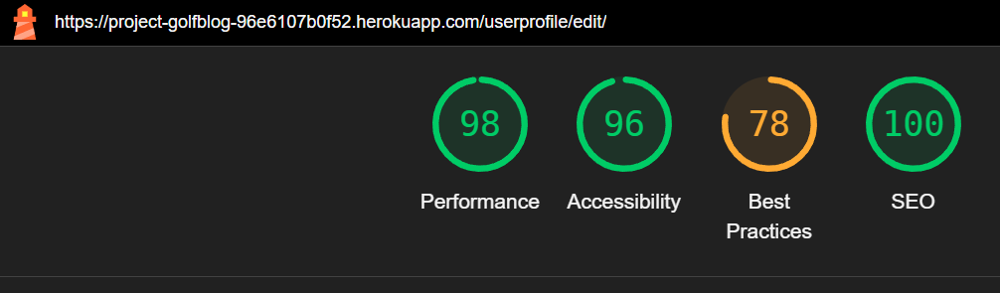

* Mobile view
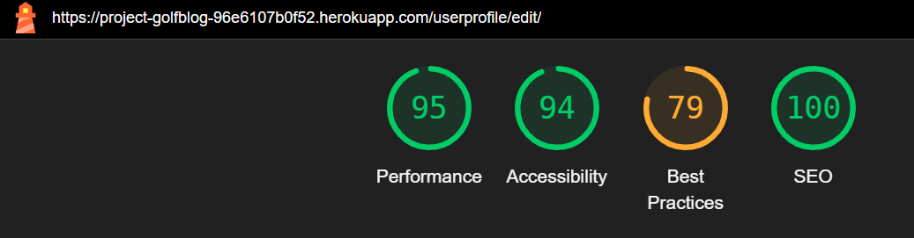
</details><br/>

<details><summary><b>Lighthouse Add Post Result</b></summary>

* Desktop view
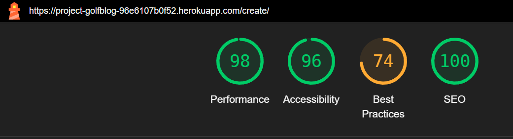

* Mobile view
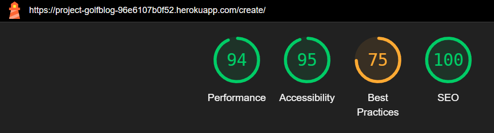
</details><br/>

<details><summary><b>Lighthouse About Result</b></summary>

* Desktop view: Logged in
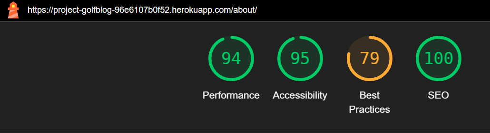

* Desktop view: Logged out
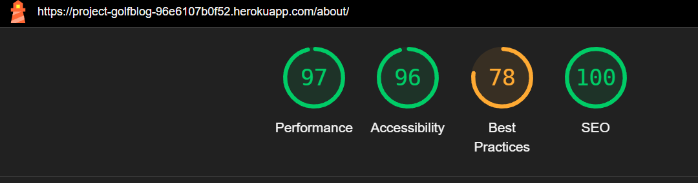

* Mobile view: Logged in

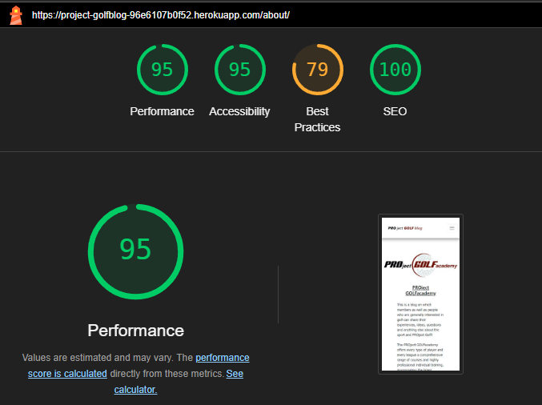

* Mobile view: Logged out
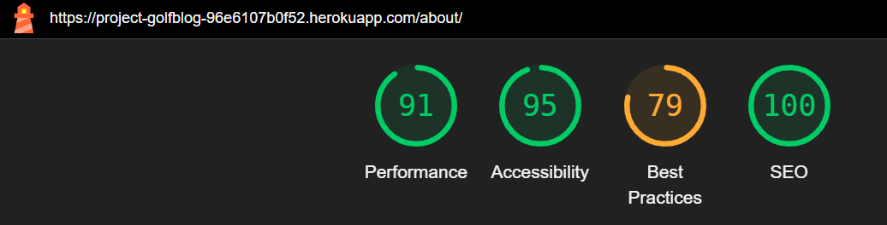
</details><br/>

### Peer Review
Additional testing of the application was conducted by people outside of the software development field by friends and family. No errors (excluding the CSRF error) and no issues with design or handling of the site were found. Also my webpage has been tested by fellow Code Insititute students Marcellio and Linus with the same result.

[Back to top](<#table-of-content>)

## Known bugs
* A staff member cannot pin a post in the admin panel without haveing at least one like 
* Sometimes when using the chrome auto fill function to log in, a CSRF error appears - when pressing the "back" button in the browser, the user will be redirected to the **Home** page and will be logged in:

<details><summary><b>CSRF Error</b></summary>

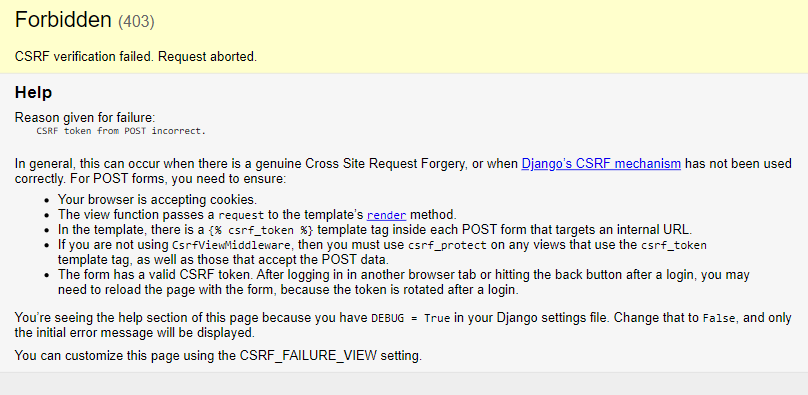

* After pressing the back button:

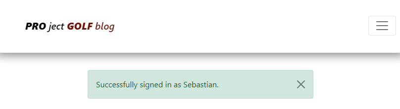
</details><br/>

### Fixed Bugs
**2024-07-31**
* Problems with "git commit not possible" because of user story template commit directly in github. fix Provided by tutor support (Oisin).

**2024-08-03**
* Due to wrong migrations, the programm stopped working. Instead of fixing the issue in the early stages, I started a new repository.

**2024-08-29**
* Bug: The active page indicator was implemented, but did not work on the "Add Post" Nav-bar link. Therefore the "active" indicator was taken out for now.

**2024-08-29**
* Bug: Missing "div" elements were causing a validation error. 

**2024-09-02**
* Bug: Due to problems in the requirements.txt file, I was unable to deploy on heroku. Rerunning the "pip3 freeze > requirements.txt" command fixed the problem.

**2024-09-03**
* Bug: Search: titles of posts were not shown, it just returned the same string over and over (functioning as a link for the correct post). Fixed this issue with my mentor by removing a string from the "Post" model.

**2024-09-03**
* Bug: Profile dropdown menu does not work when on someone elses profile, also if visiting an admins profile, the user would see the "Admin Panel" link. Fixed this issue with my mentor by changing the code in the base.html template from ** to just ** (Profile dropdown menu fix) and by changing ** to ** only admins are now able to see the "Admin Panel"

### Unfixed Bugs

**2024-09-03**
* CSRF error, more info in the *Known Bugs* section.
* A staff member cannot pin a post in the admin panel without haveing at least one like 

# Deployment

## Deployment To Heroku

The project was deployed to [Heroku](https://www.heroku.com). To deploy a project, these are the steps:

1. Begin by creating a GitHub repository using the [Code Institute template](https://github.com/Code-Institute-Org/gitpod-full-template). Navigate to the template and select 'Use this template'.

<details><summary><b>Heroku Deployment - Step 1</b></summary>


</details><br />

2. Complete the necessary details as shown in the provided image, then click 'Create Repository From Template'.

<details><summary><b>Heroku Deployment - Step 2</b></summary>

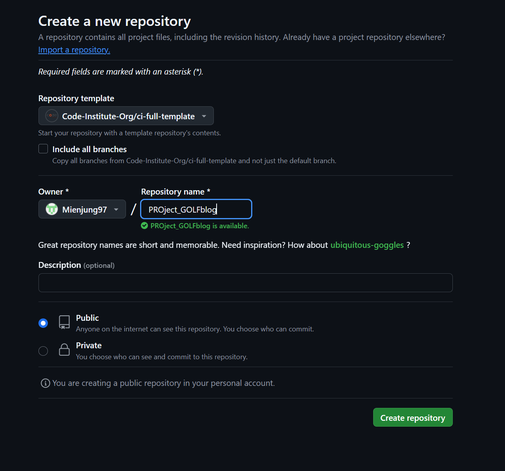
</details><br />

3. After the repository is created, click on 'Gitpod' as indicated in the picture.

<details><summary><b>Heroku Deployment - Step 3</b></summary>

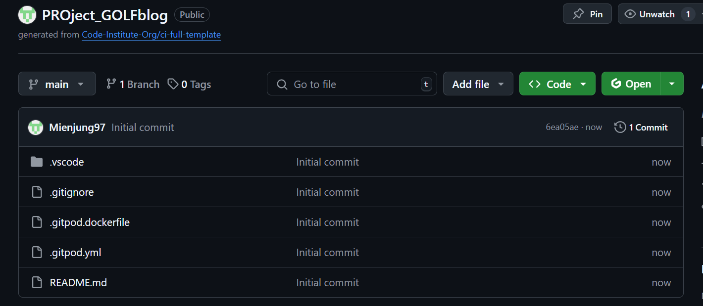
</details><br />

4. Install Django by entering this command:

* ```pip3 install Django~=4.2.1```

<details><summary><b>Heroku Deployment - Step 4</b></summary>

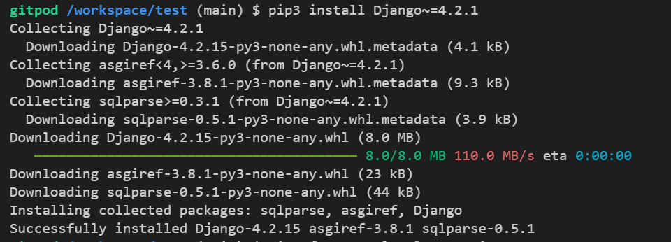
</details><br />

5. Generate a requirements file using the following command:

* ```pip3 freeze --local > requirements.txt``` - This will create the requirements.txt file and adds required libraries to it. This command needs to exectuted every time a new libary gets added to the project.

<details><summary><b>Heroku Deployment - Step 5</b></summary>

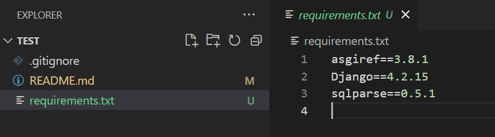
</details><br />

6. Create your project:

* ```django-admin startproject YOUR_PROJECT_NAME .``` - "YOUR_PROJECT_NAME" is the name you choose for your project.

<details><summary><b>Heroku Deployment - Step 6</b></summary>

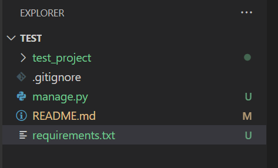
</details><br />

7. Create your application using:

* ```python3 manage.py startapp APP_NAME``` - This will create your application with the name "APP-NAME"

<details><summary><b>Heroku Deployment - Step 7</b></summary>

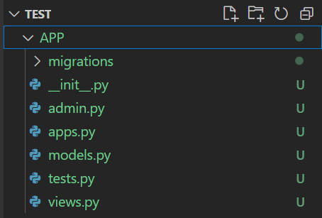
</details><br />

8. Add your local server to "ALLOWED_HOSTS" in the settings.py file. For this you need to run the command

* ```python3 manage.py runserver``` - This runs the server. This will give you an error message "DisallowedHost at /", following the link of your local server. Copy this link and add it in your settings.py file.
* While in the settings.py file, also add your newly created app in the "INSTALLED_APPS" section at the bottom of the list. In the picture, the first app is called "APP".

<details><summary><b>Heroku Deployment - Step 8</b></summary>

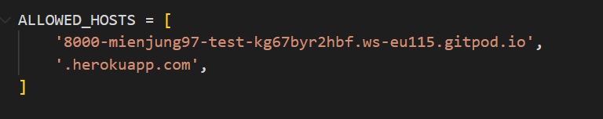
</details><br />

9. To get the code ready for deployment, gunicorn needs to be installed and added to the requirements with the following commands:

* ```pip3 install gunicorn~=20.1``` - This installs gunicorn
* ```pip3 freeze --local > requirements.txt``` - This will add gunicorn to the requirements.txt file

<details><summary><b>Heroku Deployment - Step 9</b></summary>

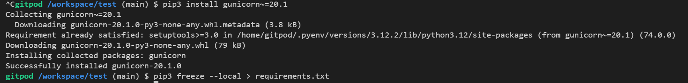
</details><br />

10. Create a file in the root directory named "Procfile" and add the nessesary lines to the settings.py file:

- Procfile:
* ```web: gunicorn "proejec_name".wsgi``` - "project_name" stands for the name of your project
- settings.py:
* ```DEBUG = False``` - This is the debug line in the settings.py file. It is very important that debug is never set to "True" on a deployed webpage for security reasons. While in development, DEBUG should be set to "True"
* ```,'.herokuapp.com'``` needs to be added to the "ALLOWED_HOSTS" section in the settings.py file, so that heroku has the permission to access the project.

<details><summary><b>Heroku Deployment - Step 10 - Procfile</b></summary>

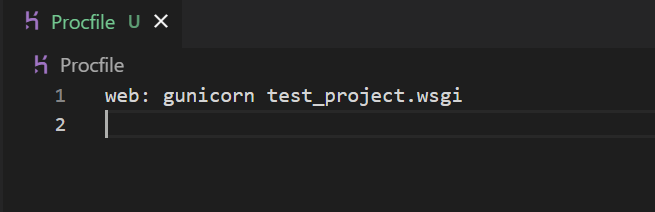
</details><br />

<details><summary><b>Heroku Deployment - Step 10 - settings.py</b></summary>

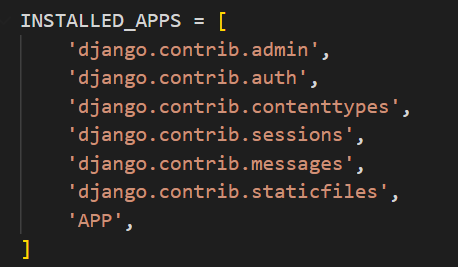
</details><br />

11. Now it is time to create the application on Heroku:

* Head on to [Heroku](https://www.heroku.com/) and sign in (or create an account if needed).

* In the top right corner there is a button that is labeled 'New'. Click that and then select 'Create new app'.

<details><summary><b>Heroku Step 11</b></summary>

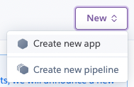
</details><br />

12. On Heroku, enter a unique application name, choose your region, and click 'Create app':

<details><summary><b>Heroku Step 12</b></summary>


</details><br />

13. Add a Postgres database, which is created with the Code Institute link for [PostgresSQL](https://dbs.ci-dbs.net/) from the LMS and add it to your app via the Settings tab on Heroku:

* Press "Reveal Config Vars" and add "DATABASE_URL" as key and enter the postgres URL, which has been sent by email, as the value.
* Addistionally, add the "DISABLE_COLLECTSTATIC" key with a value of "1" as a second config var. This is nessesary for the later implementation of the Cloudinary API.

<details><summary><b>Heroku Step 13</b></summary>

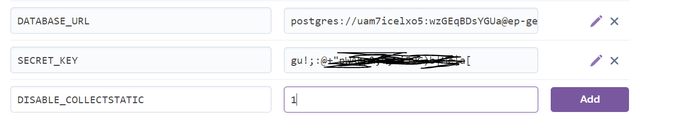
</details><br />

14. In GitPod, create an env.py file in the top-level directory with the following content:

* ```import os``` - This imports the os library
* ```os.environ("DATABASE_URL", "postgres://*********************")``` - This sets database variable to your PostgresSQL database.
* ```os.environ("SECRET_KEY", "actual_secret_key")``` - You can create your own key with a webpage like [RandomKeyGen](https://randomkeygen.com/).
* if using the Code Institute template, the env.py file should already be in the "gitignore" file, if not, it has to be added manually.

<details><summary><b>Heroku Step 14</b></summary>

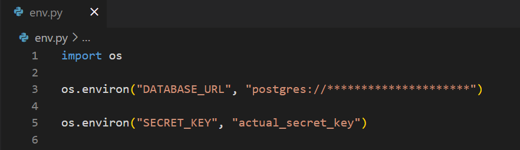
</details><br />

15. Add your secret key to Heroku's Config Vars: Look at step 13

16. In settings.py, add the following code:

```import os```

```import dj_database_url```

```if os.path.isfile("env.py"):```

```import env```

<details><summary><b>Heroku Step 16</b></summary>

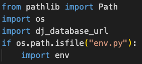
</details><br />

17. Replace the insecure secret key in settings.py with:
```SECRET_KEY = os.environ.get('SECRET_KEY')```

<details><summary><b>Heroku Step 17</b></summary>

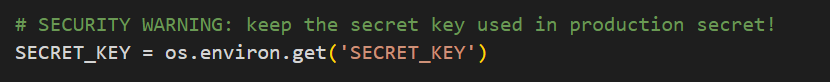
</details><br />

18. Comment out the old database settings and add the link to DATABASE_URL since the project does not use the standart sqlite3 database. 

```
DATABASES = {
    'default': dj_database_url.parse(os.environ.get("DATABASE_URL"))
}
```

<details><summary><b>Heroku Step 18</b></summary>

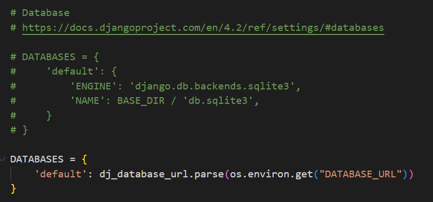
</details><br />


18. Save all your fields and migrate the changes with the following commands:

```python3 manage.py migrate```

19. Set up Cloudinary for static file storage: After creating a Cloudinary account, you can copy the API Environment Variable from the Cloudinary dashboard.

20. In the env.py file, add the Cloudinary url (it's very important that the url is unaltered):

```os.environ.setdefault("CLOUDINARY_URL", "cloudinary://*********************************")```

21. In the Config Vars of heroku, add the Cloudinary url (CLOUDINARY_URL as the key, the actual url as the value). 

<details><summary><b>Heroku Step 21</b></summary>

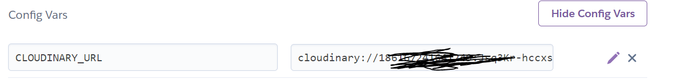
</details><br />

22. In the settings.py file, the Cloudinary Libraries have to be added to the installed apps. The correct order is very important.

<details><summary><b>Heroku Step 22</b></summary>


</details><br />

23. In the bottom of settings.py, add additional settings for static file management:

<details><summary><b>Heroku Step 23</b></summary>

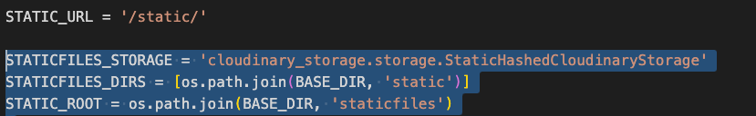
</details><br />

24. The next step is to link the file to the Heroku templates directory:

<details><summary><b>Heroku Step 24</b></summary>

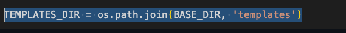
</details><br />

25. Now edit the templates directory to "TEMPLATES_DIR" in the teamplates array.

<details><summary><b>Heroku Step 25</b></summary>

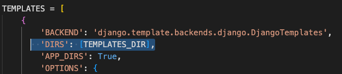
</details><br />

26. Some more files are needed before deploying:

* Create 2 folders in the top level directory: **static** and **templates**
* The **static** folder will include all CSS and JS files as well as images.
* The **templates** folder will include the "base.html" file, as well as all django related templates.

27. Make sure that all the files are saved, then enter the following lines in the console for the first commit and push to Github:

* ```git add .```
* ```git commit -m "Deployment commit"```
* ```git push```

30. Now it's time for deployment. Scroll to the top of the settings page in Heroku and click the 'Deploy' tab. For deployment method, select 'Github'. Search for the repository name you want to deploy and then click connect.

31. Scroll down to the manual deployment section and click 'Deploy Branch'.

The live link to the 'PROject GOLFblog' site on Heroku an be found [here](https://project-golfblog-96e6107b0f52.herokuapp.com/). And the Github repository can be found [here](https://github.com/Mienjung97/PROject-GOLFblog).

[Back to top](<#table-of-content>)

## How To Fork The Repository On GitHub

It is possible to do a independent copy of a GitHub Repository by forking the GitHub account. The copy can then be viewed and it is also possible to do changes in the copy without affecting the original repository. To fork the repository, take these steps:

1. After logging in to GitHub, locate the repository. On the top right side of the page there is a 'Fork' button. Click on the button to create a copy of the original repository.

<details><summary><b>Github Fork</b></summary>

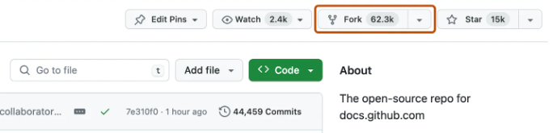
</details><br />

[Back to top](<#table-of-content>)

## Cloning And Setting Up This Project

To clone and set up this project you need to follow the steps below.

1. When you are in the repository, find the code tab and click it.
2. To the left of the green GitPod button, press the 'code' menu. There you will find a link to the repository. Click on the clipboard icon to copy the URL.
3. Use an IDE and open Git Bash. Change directory to the location where you want the cloned directory to be made.
4. Type 'git clone', and then paste the URL that you copied from GitHub. Press enter and a local clone will be created.

<details><summary><b>Github Create Local Clone</b></summary>

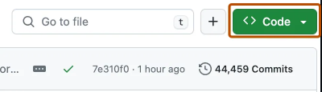
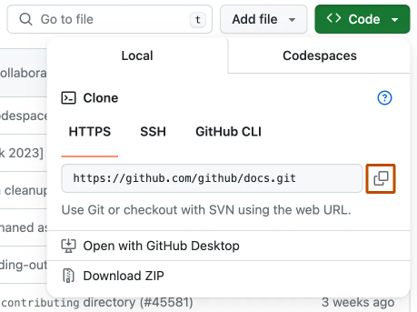
</details><br />

5. To be able to get the project to work you need to install the requirements. This can be done by using the command below:

* ```pip3 install -r requirements.txt``` - This command downloads and install all required dependencies that is stated in the requirements file.

6. The next step is to set up the environment file so that the project knows what variables that needs to be used for it to work. Environment variables are usually hidden due to sensitive information. It's very important that you don't push the env.py file to Github (this can be secured by adding env.py to the .gitignore-file). The variables that are declared in the env.py file needs to be added to the Heroku config vars. Don't forget to do necessary migrations before trying to run the server.

* ```python3 manage.py migrate``` - This will do the necessary migrations.
* ```python3 manage.py runserver``` - If everything i setup correctly the project is now live locally.

[Back to top](<#table-of-content>)

# Credits

## Content

* This Readme file has been taken from [Marcus Erikssons PP4](https://github.com/worldofmarcus/project-portfolio-4/blob/main/README.md#existing-features) and modified by me to fit my project. Some sections have been changed only slighly since the original was already fitting my needs and was very close to my projectn (the "Forc" and "Clone" sections were taken intirely since the process has not changed).
    * *Marcus Erikssons*: "Template for read.me provided by Code Institute (*with some additional changes that my mentor [Precious Ijege](https://www.linkedin.com/in/precious-ijege-908a00168/))* suggested."

* My project **PROject GOLFblog** has started almost as a copy of the example project *I think therefore I blog* and has been edited in most areas ever since, but especially the **Post**, **Comment** and **About** models, as well as the JS code for the comment section has been almost unaltered.

* The [Codemy.com](https://www.youtube.com/@Codemycom) YouTube channel, especially their Django blog example helped me implement features like the like function and displaying the likes

* I used some help from various more YouTube tutorials and w3schools tutorials.

* [Linuses PP4](https://github.com/j0hanz/tech-corner-website) (with linus himself) helped me with implementing code that he suggested for better UX like starting on a different page depending on the users log in status

* Pictures and checking if the process of forking and clong were correct with [Github tutorial](https://docs.github.com/en/pull-requests/collaborating-with-pull-requests/working-with-forks/fork-a-repo)

* All pictrures on the webpage were used from the [PROject GOLFacademy](https://projectgolfacademy.com/) website, besides:
    * Profile picture for Assessor: Photo by <a href="https://unsplash.com/@markusspiske?utm_content=creditCopyText&utm_medium=referral&utm_source=unsplash">Markus Spiske</a> on <a href="https://unsplash.com/photos/colorful-software-or-web-code-on-a-computer-monitor-Skf7HxARcoc?utm_content=creditCopyText&utm_medium=referral&utm_source=unsplash">Unsplash</a>
    * my Profile (Sebastian) Picture: Photo by <a href="https://unsplash.com/@alexacea?utm_content=creditCopyText&utm_medium=referral&utm_source=unsplash">Alexandru Acea</a> on <a href="https://unsplash.com/photos/turned-on-flat-screen-tv--WBYxmW4yuw?utm_content=creditCopyText&utm_medium=referral&utm_source=unsplash">Unsplash</a>

## Technical

* Many different posts on [Stackoverflow](https://stackoverflow.com/) have helped me understand Django and its functionality better, as well as it helped me fix bugs while coding

* The [Bootstrap](https://getbootstrap.com/) documentation helped me a lot with the styling of my page

* The AI tool [perplexity](https://www.perplexity.ai/) was used a lot for debugging and helping to understand my mistakes. No code was written by AI, the tool was just used in case of bugs and missing understanding on how a feature works

* The *I think therefore I blog* code along project from Code Institute has been a valuable source for both starting the project as well as for setting up new apps, models, urls and views

# Acknowledgements
* I have to thank my dear partner for being so patient since there is not a lot of free time and yet she fully supports me on a daily basis

* This website was created for Portfolio Project #4 - Diploma in Full Stack Software Development Diploma at the [Code Institute](https://www.codeinstitute.net). I would like to thank my mentor [Alshat Garg](https://in.linkedin.com/in/akshatnitd) for relevant feedback and bug hunting during the project.

* I am also thankful for my co-student [Marceillo](https://github.com/Marceillo) and [Linus](https://github.com/j0hanz), who I worked closely together, and who helped me with questions, gave their input and in times of question.

* A big thank you goes out to the Tutors who have helped me along my fourth protfolio project

*Sebastian Kefer, 04.09.2024*

[Back to top](<#table-of-content>)
